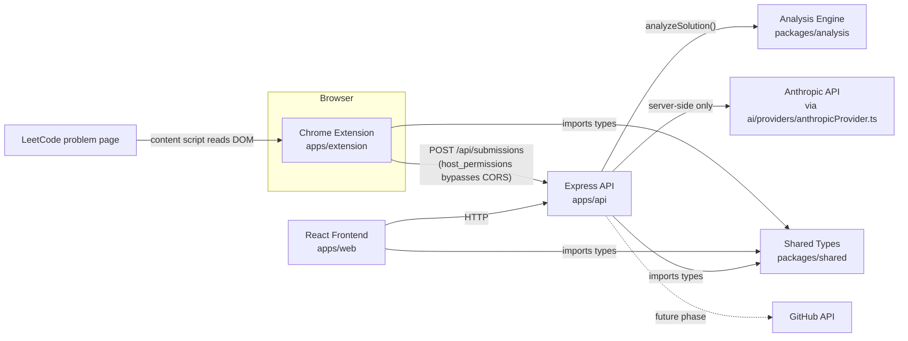

# CodeReviewAI — AI-Powered LeetCode Solution Analyzer

> **Status: Phase 5 of 10 — AI-Powered Solution Review.** `POST /api/submissions/:id/review`
> combines Phase 4's deterministic analysis with a schema-validated AI review (Anthropic
> Claude) answering all 16 required review questions — and explicitly exposes any disagreement
> between the two rather than hiding it. Document generation and GitHub integration remain
> unimplemented — see [Phase Status](#21-phase-status) and
> [docs/phases/phase-05.md](docs/phases/phase-05.md) /
> [docs/ai-analysis.md](docs/ai-analysis.md) for exactly what is implemented today (Phase 1:
> [docs/phases/phase-01.md](docs/phases/phase-01.md), Phase 2:
> [docs/phases/phase-02.md](docs/phases/phase-02.md), Phase 3:
> [docs/phases/phase-03.md](docs/phases/phase-03.md), Phase 4:
> [docs/phases/phase-04.md](docs/phases/phase-04.md)).

## 1. What this project does

CodeReviewAI turns a LeetCode submission into a structured learning artifact. The intended
end-to-end flow (built incrementally across later phases) is:

1. You solve a problem on LeetCode and submit your solution.
2. A Chrome extension captures the problem metadata and your submitted code.
3. The captured data is sent to a backend API.
4. An AI layer analyzes the solution: it identifies the DSA pattern/technique used, explains
   why the solution works, evaluates time and space complexity, points out weaknesses, suggests
   improvements, and compares the solution against a more optimal approach.
5. The analysis is rendered into a Markdown "learning document."
6. That document is automatically committed to a GitHub repository, building a personal,
   versioned log of solved problems and what was learned from each one.

## 2. Problem this project solves

Solving LeetCode problems in isolation rarely produces durable learning. Once a submission is
accepted, most people move on without recording *why* the solution worked, what pattern it
used, or how it compares to the optimal approach — so the same gaps resurface in later
problems and in interviews. CodeReviewAI closes that loop automatically: every accepted
submission becomes a reviewed, explained, and permanently recorded learning artifact with
zero manual write-up effort.

## 3. Target users

- Developers preparing for technical interviews who want a structured, cumulative record of
  what they've practiced and learned.
- Self-taught or CS-adjacent engineers building DSA pattern recognition over time.
- Anyone who wants a public (or private) GitHub log of their problem-solving growth without
  manually writing notes after every submission.

## 4. Main features planned (across all 10 phases)

- Chrome extension that captures LeetCode problem + submission data (Phase 2–3)
- Backend API to receive and store submission payloads (Phase 3)
- Deterministic (non-AI) pattern detection, complexity estimation, code-quality and edge-case
  analysis (Phase 4)
- AI-powered solution review layered on top of Phase 4's deterministic findings, answering 16
  required review questions with disagreement between the AI and static analysis explicitly
  surfaced (Phase 5)
- Automatic generation of a structured Markdown learning document per submission, plus real
  (database) persistence (Phase 6)
- Automatic commit of that document to a GitHub repository via the GitHub API (Phase 7)
- A web dashboard to browse past submissions and generated documents (Phase 8)
- Authentication and polish (Phase 9–10)

## 5. Current implementation status

**Phases 1–5.** What exists right now:

- A working npm-workspaces monorepo with five packages (`apps/web`, `apps/api`,
  `apps/extension`, `packages/shared`, `packages/analysis`).
- A React + Vite frontend that renders a status page and calls the backend health endpoint.
- An Express + TypeScript backend with `GET /api/health` and (Phase 3) `POST /api/submissions`
  — layered routes → validation middleware → controllers → services → repositories, with a
  Zod schema that is the real runtime source of truth for what the server accepts, a
  normalizing/id-assigning service, an in-memory repository behind a swappable interface, and
  centralized error handling with a consistent JSON envelope for every failure. Full reference:
  [docs/api.md](docs/api.md).
- A Chrome Extension (Manifest V3) with a content script that runs on LeetCode problem pages
  and extracts problem/submission data (title, slug, number, difficulty, description,
  language, submitted code, submission status, runtime, memory) via a dedicated, modular
  LeetCode adapter (`apps/extension/src/content/leetcode/`) — every field falls back to `null`
  ("Unavailable" in the UI) rather than guessing when it can't be found reliably.
- A popup UI with **Extract Problem** (friendly summary), **Analyze Solution** (raw JSON debug
  view — no AI call yet), and (Phase 3) **Submit Solution** (POSTs the extraction to the API,
  showing loading/success/validation-error/failure states).
- A shared TypeScript package with a common API response envelope, health-check types, the
  `LeetCodeExtraction` domain type, and (Phase 3) the `POST /api/submissions` wire contract
  (`CreateSubmissionRequest`/`StoredSubmission`) plus the LeetCode URL-parsing logic, shared
  between the extension and the API so both validate a problem URL the same way.
- A deterministic analysis engine, `packages/analysis` (Phase 4):
  `analyzeSolution({ code, language })` recognizes 19 algorithm patterns (Hash Map, Two
  Pointers, DFS, Dynamic Programming, ...) via a modular, confidence-scored signal engine;
  estimates time/space complexity from loop nesting, recursion, and the detected patterns; and
  flags code-quality and edge-case concerns — every output carrying its own confidence level
  and, for patterns, plain-language evidence. As of Phase 5, a real dependency of `apps/api`.
  See [docs/phases/phase-04.md](docs/phases/phase-04.md).
- An AI-powered review layer, `apps/api/src/ai/` (Phase 5): `POST
  /api/submissions/:id/review` runs Phase 4's deterministic analysis, sends the problem +
  code + that analysis to an LLM provider (Anthropic Claude, behind a swappable
  `AiProvider` interface), validates the response against a strict Zod schema, and returns
  **both** analyses side by side plus an explicit `agreement` comparison — never merging them
  or hiding a disagreement. Every AI failure mode (timeout, provider error, rate limit,
  malformed/invalid response) maps to a specific HTTP status. See
  [docs/ai-analysis.md](docs/ai-analysis.md) and [docs/phases/phase-05.md](docs/phases/phase-05.md).
- Strict TypeScript, ESLint (flat config), Prettier, and Vitest configured and passing across
  every package — 232 tests total (100 API — 56 new this phase, 41 extension, 2 web, 16
  shared, 73 analysis). No test anywhere ever makes a real AI API call — every AI-facing test
  uses a mocked provider.

Nothing beyond this exists yet. There is no database (submissions live in memory and are lost
on API restart), no authentication, no document generation, and no GitHub integration — see
[Known Limitations](#27-known-limitations).

## 6. Architecture overview



Implemented today: the web frontend calls the API's health endpoint (proxied through Vite in
development); the extension's content script reads a LeetCode problem page's DOM and returns
structured data to the popup on request; the popup can POST that data to
`POST /api/submissions`, which validates, normalizes, and stores it; all three apps share type
definitions from `packages/shared`; the deterministic analysis engine (`packages/analysis`,
Phase 4) is now a real dependency of `apps/api`; and `POST /api/submissions/:id/review` (Phase
5) combines that deterministic analysis with a schema-validated AI review, calling Anthropic's
API server-side only. The dotted arrow is a future-phase connection, described for context in
[docs/architecture.md](docs/architecture.md).

## 7. Technology stack

| Area       | Technology                                   | Why                                                                                          |
| ---------- | --------------------------------------------- | ---------------------------------------------------------------------------------------------- |
| Frontend   | React 19, TypeScript, Vite                   | Fast dev server, minimal config, industry-standard component model.                            |
| Backend    | Node.js, Express 5, TypeScript, Zod           | Small, well-understood HTTP framework; Zod gives runtime schema validation that doesn't just trust a client-side TypeScript type. |
| Extension  | Chrome Extension Manifest V3, TypeScript, esbuild | MV3 is the current Chrome extension standard; esbuild gives fast, dependency-light bundling.   |
| Shared     | TypeScript project (`packages/shared`)       | Single source of truth for types/contracts shared across web, api, and extension.              |
| Analysis   | TypeScript project (`packages/analysis`), no runtime dependencies | Deterministic pattern/complexity/quality/edge-case heuristics, kept dependency-free and standalone so it's trivially testable and reusable from any future consumer. |
| AI         | Anthropic Claude (Messages API), called via a swappable `AiProvider` interface | A structured, schema-validated review layered on Phase 4's deterministic findings; the provider abstraction means a different LLM vendor is a new file, not a rewrite. |
| Testing    | Vitest, Supertest, React Testing Library      | Fast, Vite-native test runner; Supertest for HTTP assertions; RTL for component behavior.       |
| Code quality | ESLint (flat config) + typescript-eslint, Prettier | Consistent style and catch common bugs across a multi-package repo from one root config.  |
| Tooling    | npm workspaces                                | See [Package management decision](#package-management-decision) below.                         |

### Package management decision

This project uses **npm workspaces** rather than a separate monorepo tool (Turborepo, Nx,
pnpm+Lerna, etc.). Reasoning:

- npm workspaces ship with npm itself (no extra global tool to install or version).
- Phase 1's dependency graph is small and shallow (`api`, `web`, and `extension` each depend
  only on `shared`) — there's no need for a task-graph orchestrator or remote build cache yet.
- A single lockfile and `node_modules` tree keeps dependency versions consistent across
  packages without extra configuration.
- If build orchestration complexity grows in later phases (e.g. many interdependent
  packages, slow CI), Turborepo or Nx can be layered on top of the existing workspace
  structure without restructuring the repo.

## 8. Repository structure

```
/
├── apps/
│   ├── web/            React + Vite frontend
│   ├── api/             Express + TypeScript backend
│   │       └── src/
│   │           ├── routes/          POST /api/submissions(/:id/review), GET /api/health
│   │           ├── controllers/      Thin HTTP handlers
│   │           ├── services/          Business logic (normalize, assign id, persist)
│   │           ├── schemas/            Zod validation (the real runtime contract)
│   │           ├── repositories/        Storage abstraction (in-memory today)
│   │           ├── middleware/           validateBody, errorHandler, requestLogger
│   │           ├── types/                 ApiError/ValidationError/NotFoundError
│   │           └── ai/                     AI review layer (Phase 5 — see below)
│   │               ├── prompts/               System/user prompt construction
│   │               ├── providers/              AiProvider interface + Anthropic implementation
│   │               ├── schemas/                  Zod schema for the AI's structured output
│   │               └── ai-review.service.ts        Orchestrator: prompt → provider → validate
│   └── extension/        Chrome Extension (Manifest V3)
│       └── src/
│           ├── content/leetcode/   LeetCode extraction adapter (parser, selectors,
│           │                       extractor, url, types — see docs/phases/phase-02.md)
│           ├── popup/               Extension popup UI
│           ├── background/          Background service worker
│           └── lib/                 Messaging contract + API client (lib/api.ts)
│
├── packages/
│   ├── shared/          Shared TypeScript types and small utilities
│   └── analysis/         Deterministic solution-analysis engine (Phase 4)
│       └── src/
│           ├── pattern-detector/    19 algorithm patterns, signal-based rule engine
│           ├── complexity-analyzer/  Time/space complexity heuristics
│           ├── code-review/           Style/maintainability observations
│           ├── edge-case-analyzer/     Input-robustness observations
│           ├── shared/                  Loop-nesting + recursion detection primitives
│           ├── fixtures/                 7 required-problem example solutions
│           └── solution-analyzer.ts       The one public entry point, analyzeSolution()
│
├── docs/
│   ├── api.md
│   ├── ai-analysis.md
│   ├── architecture.md
│   ├── development.md
│   ├── project-overview.md
│   └── phases/
│       ├── phase-01.md
│       ├── phase-02.md
│       ├── phase-03.md
│       ├── phase-04.md
│       └── phase-05.md
│
├── .env.example
├── .gitignore
├── .prettierrc.json / .prettierignore
├── eslint.config.mjs
├── package.json          Root workspace config + shared scripts
├── tsconfig.json          Shared base TypeScript compiler options
└── README.md
```

## 9–12. Folder and file explanations

### `apps/web` — React frontend

Vite + React + TypeScript app. `src/App.tsx` renders the project status page and calls
`GET /api/health` (proxied to the backend by Vite's dev server so the frontend never
hardcodes a backend port). `src/main.tsx` is the React entry point. `vite.config.ts`
configures the dev server proxy and Vitest's `jsdom` test environment.

### `apps/api` — Express backend

`src/index.ts` is the process entry point: it loads environment variables and starts the
HTTP server. `src/app.ts` builds the Express `app` (CORS, request logging, JSON body parsing,
route mounting, a 404 handler, and — last — the centralized error handler) as a factory
function so tests can construct an app instance without binding a real port.
`src/routes/health.route.ts` implements `GET /api/health`.

`POST /api/submissions` (Phase 3 — full reference in [docs/api.md](docs/api.md)) is layered:
`src/schemas/submission.schema.ts` (a Zod schema — the actual runtime-enforced contract, not
just the TypeScript type) → `src/middleware/validateBody.ts` (a generic, reusable
validate-or-400 middleware) → `src/controllers/submissions.controller.ts` (thin: call the
service, respond) → `src/services/submissions.service.ts` (normalizes fields, assigns a
`crypto.randomUUID()` id, records a server-side timestamp) → `src/repositories/
submissions.repository.ts` (a `SubmissionRepository` interface + an `InMemorySubmissionRepository`
implementation, so a real database can implement the same interface later without touching
anything above it — Phase 5 added `findById` to this interface, the first read method it's
needed). `src/middleware/errorHandler.ts` maps every thrown/forwarded error — validation
failures, malformed JSON, anything unexpected — to the same consistent `ApiResponse` envelope
and an appropriate status code, so no route ever hand-rolls its own error response.

`POST /api/submissions/:id/review` (Phase 5 — full reference in
[docs/api.md](docs/api.md#post-apisubmissionsidreview) and
[docs/ai-analysis.md](docs/ai-analysis.md)) is the newest endpoint: `src/controllers/
reviews.controller.ts` loads the stored submission, runs `analyzeSolution()` from
`@codereviewai/analysis` fresh, and calls `src/ai/ai-review.service.ts` — which builds a prompt
(`src/ai/prompts/reviewPrompt.ts`), calls an injected `AiProvider` (`src/ai/providers/` — the
real implementation calls Anthropic's Messages API; a `mockProvider.ts` exists for tests only
and is excluded from the production build), and validates the raw response against
`src/ai/schemas/solutionReview.schema.ts` before trusting it. `src/ai/agreement.ts` then
compares the deterministic and AI complexity/pattern claims and reports exactly where they
agree or don't (`ai/types.ts`'s `CombinedSolutionReview` keeps both analyses and the
comparison side by side — never merged). Every AI-specific failure is one `AiReviewError`
(`src/ai/errors.ts`), translated to an HTTP status in the controller.

### `apps/extension` — Chrome Extension (Manifest V3)

`manifest.json` declares an MV3 extension with a popup, a background service worker, and (as
of Phase 2) a content script matching `https://leetcode.com/problems/*`. It requests **zero**
`permissions` and one narrowly-scoped `host_permissions` entry added in Phase 3,
`http://localhost:4000/*` — needed so the popup's `fetch` to the local API isn't blocked by
CORS (a `chrome-extension://<id>` origin can never be pre-added to a server's CORS allowlist,
since unpacked-extension ids aren't stable/known in advance; a declared `host_permissions`
grant is the platform-correct way an MV3 extension bypasses CORS for a specific origin instead).
`src/background/service-worker.ts` and `src/popup/popup.ts` are TypeScript entry points
bundled by `scripts/build.mjs` (an esbuild script, chosen over Vite here because MV3
background/popup/content bundles are simple, independent scripts that don't need a dev server
or HMR). `src/lib/messaging.ts` defines the request/response message contract between the
popup and the content script; `src/lib/api.ts` (Phase 3) is the extension's only
network-calling code — it maps an extraction onto the API's wire contract and POSTs it to
`POST /api/submissions`, returning a typed success/validation-error/error outcome the popup
renders directly.

`src/content/leetcode/` is the dedicated LeetCode extraction adapter (full detail in
[docs/phases/phase-02.md](docs/phases/phase-02.md)):

- **`url.ts`** — a thin re-export of `isLeetCodeProblemUrl`/`extractSlugFromUrl` from
  `@codereviewai/shared` (the logic itself moved there in Phase 3 so the API can validate a
  submitted URL with the exact same check); no DOM access, so it's the cheapest and most
  reliable "is this a problem page" signal.
- **`selectors.ts`** — every LeetCode-specific CSS selector and text whitelist, isolated in
  one file so markup drift only requires updating here, not throughout the codebase.
- **`extractor.ts`** — low-level DOM-reading primitives (each takes its search root as a
  parameter, so it's testable against a plain jsdom document, not just the real page).
- **`parser.ts`** — the single public entry point (`parseLeetCodeExtraction`) that orchestrates
  the above into a fully-typed `LeetCodeExtraction`, with `null` for anything not found and a
  `warnings` list of which fields fell back.
- **`types.ts`** — re-exports the LeetCode domain types from `@codereviewai/shared` so this
  folder's own modules never need to reach outside it.
- **`index.ts`** — the actual content-script entry point injected into the page; listens for a
  popup message and responds with a fresh extraction.

### `packages/shared` — Shared TypeScript types

`src/types/api.ts` defines `ApiResponse<T>` (the success/error envelope every endpoint
returns, extended in Phase 3 with an optional `error.details` for validation issues) and
`HealthStatus` (the health-check payload shape). `src/utils/apiResponse.ts` provides small
`success()` / `failure()` / `isSuccess()` helpers so every package constructs and narrows API
responses the same way. `src/types/leetcode.ts` (added in Phase 2) defines `LeetCodeExtraction`
and its nested types. `src/types/submission.ts` (Phase 3) defines `CreateSubmissionRequest` /
`StoredSubmission` — the `POST /api/submissions` wire contract, reusing the Phase 2 types
as-is. `src/utils/leetcodeUrl.ts` (moved here from the extension in Phase 3) holds
`isLeetCodeProblemUrl`/`extractSlugFromUrl`, so the extension and the API validate a LeetCode
URL with the exact same logic instead of two copies that could drift apart.

### `packages/analysis` — Deterministic solution-analysis engine

A standalone, dependency-free package: `analyzeSolution({ code, language })` →
`SolutionAnalysis`. `src/pattern-detector/` recognizes 19 algorithm patterns via a modular,
signal-based rule engine (each rule is a list of weighted regex/predicate signals; a pattern is
reported only once matched evidence clears a threshold, with a confidence score that scales
with — but isn't a raw fraction of — every possible signal, since most signals within a rule are
mutually-exclusive language alternatives, not independent corroborating evidence).
`src/complexity-analyzer/` estimates time/space complexity from loop-nesting depth, recursion,
and the already-detected patterns, always stating its reasoning and never claiming
mathematical certainty. `src/code-review/` and `src/edge-case-analyzer/` flag
style/maintainability and input-robustness concerns respectively. `src/shared/codeStructure.ts`
holds the loop-nesting and recursion-detection primitives every other module depends on.
`src/fixtures/` holds real example solutions for the 7 required problems, used throughout the
test suite. As of Phase 5, `analyzeSolution()` is called by `apps/api/src/controllers/
reviews.controller.ts` on every `POST /api/submissions/:id/review` request, recomputed fresh
each time rather than cached. Full detail: [docs/phases/phase-04.md](docs/phases/phase-04.md).

### `docs/`

Project-level documentation, described in [Documentation](#documentation-map) below.

### Root config files

- **`package.json`** — declares the five workspaces and root-level dev tooling
  (TypeScript, ESLint, Prettier) shared by all of them, plus scripts that run a command across
  every workspace.
- **`tsconfig.json`** — the strict, shared base `compilerOptions` every workspace's own
  `tsconfig.json` extends, so strictness settings live in one place.
- **`eslint.config.mjs`** — a single flat ESLint config applied to the whole repo, with
  scoped overrides for React (web) and Chrome extension globals.
- **`.env.example`** — documents every environment variable the project uses now or will use
  in a specific future phase (each future variable is commented out and labeled with the phase
  that introduces it).

## 13. How frontend/backend/extension communicate

- **Frontend ↔ Backend (implemented):** the web app calls relative `/api/...` URLs. In
  development, Vite's dev server proxies these to `http://localhost:4000` (see
  `apps/web/vite.config.ts`), so the frontend code never hardcodes the API's host/port. In
  production, the frontend and API would be served such that `/api` reaches the backend (e.g.
  a reverse proxy) — this is a deployment concern for a later phase.
- **LeetCode page ↔ Extension (implemented):** the content script
  (`apps/extension/src/content/leetcode/index.ts`) reads the current page's DOM directly; the
  popup asks it for fresh data via `chrome.tabs.sendMessage`/`chrome.runtime.onMessage` on
  demand, rather than trusting a stale extraction from page load.
- **Extension ↔ Backend (implemented):** the popup's **Submit Solution** button
  (`apps/extension/src/lib/api.ts`) POSTs a fresh extraction to `POST /api/submissions`,
  bypassing CORS via the extension's `host_permissions` grant for `http://localhost:4000`
  (rather than the API loosening its `CORS_ORIGIN` config — see [Security
  considerations](#23-security-considerations)).
- **All three ↔ Shared types:** `apps/web`, `apps/api`, and `apps/extension` all depend on
  `@codereviewai/shared` for TypeScript types, so a change to a shared contract (like
  `ApiResponse<T>`) is caught by the type checker in every consumer at once.
- **`packages/analysis` ↔ `apps/api` (implemented, Phase 5):** `analyzeSolution()` is now a
  real dependency of `apps/api`, called fresh on every `POST /api/submissions/:id/review`
  request.
- **`apps/api` ↔ Anthropic API (implemented, Phase 5, server-side only):** the AI review layer
  calls Anthropic's Messages API directly over `fetch`, behind the swappable `AiProvider`
  interface. `AI_PROVIDER_API_KEY` is read once, server-side, when constructing the real
  provider — it's never included in any HTTP response, and neither `apps/web` nor
  `apps/extension` has any code path that could read it. See
  [docs/ai-analysis.md](docs/ai-analysis.md#privacy).

## 14–17. Development setup, installation, environment variables, running

### Prerequisites

- Node.js ≥ 20 (developed against Node 24)
- npm ≥ 10 (ships with modern Node)

### Installation

```bash
npm install
```

This installs every workspace's dependencies and automatically builds `packages/shared`
(via a `postinstall` hook), since the API and web app resolve it as a normal npm package.

### Environment variables

Copy `.env.example` and fill in real values as needed:

```bash
cp .env.example apps/api/.env
```

| Variable             | Used by  | Default                 | Purpose                                                        |
| -------------------- | -------- | ------------------------ | ---------------------------------------------------------------- |
| `PORT`               | apps/api | `4000`                    | Port the Express server listens on.                              |
| `NODE_ENV`           | apps/api | `development`             | Standard Node environment flag.                                   |
| `CORS_ORIGIN`        | apps/api | `http://localhost:5173`   | Origin allowed to call the API.                                    |
| `AI_PROVIDER_API_KEY` | apps/api | *(none)*                  | Anthropic API key. Only `POST /api/submissions/:id/review` needs it — every other endpoint works fully without it. |
| `AI_PROVIDER_MODEL`   | apps/api | `claude-sonnet-5`          | Which Claude model the review endpoint calls.                     |

`GITHUB_TOKEN`/`GITHUB_REPO` are documented in `.env.example` but **not read by any code yet**
— they belong to Phase 7.

### Running the project

```bash
# Run the frontend and backend together
npm run dev

# Or run them individually
npm run dev:web    # http://localhost:5173
npm run dev:api    # http://localhost:4000

# Build the extension (loads via chrome://extensions → "Load unpacked" → apps/extension/dist)
npm run build -w @codereviewai/extension
```

To try the extension: build it, load `apps/extension/dist` as an unpacked extension in Chrome,
open any `https://leetcode.com/problems/<slug>/` page, then click the extension icon and press
**Extract Problem**. With `npm run dev:api` (or `npm run start -w @codereviewai/api`) running,
**Submit Solution** sends the extraction to the API and shows the stored result — see
[docs/api.md](docs/api.md) for the endpoint it calls.

To try the AI review (Phase 5 — no extension/web UI triggers this yet, so use `curl` or
similar): set `AI_PROVIDER_API_KEY` in `apps/api/.env`, create a submission as above to get an
`id`, then `curl -X POST http://localhost:4000/api/submissions/<id>/review`. Without a key
configured, this endpoint still responds — with a clear `502 AI_PROVIDER_ERROR` — rather than
crashing the server; every other endpoint is completely unaffected either way.

## 18. Testing

```bash
npm run test               # run every workspace's test suite
npm run test -w @codereviewai/api        # a single workspace
npm run test:watch -w @codereviewai/web  # watch mode (per-workspace script)
```

Each workspace uses Vitest — 232 tests total. `apps/api` additionally uses Supertest to
exercise the Express app over HTTP without binding a real port, covering `POST /api/submissions`
at every layer (schema rules, service normalization, repository round-trips, and full
HTTP-level integration — valid submission, invalid submission, missing code, invalid language,
invalid URL, malformed/non-JSON payload) and, since Phase 5, `POST /api/submissions/:id/review`
the same way (a full create-then-review round trip, an end-to-end disagreement scenario using
real nested-loop code against a mocked AI claiming the wrong complexity, a 404 for an unknown
id, and one test per AI failure mode mapped to its HTTP status); `apps/web` uses React Testing
Library with a `jsdom` environment; `apps/extension`'s LeetCode adapter tests construct
synthetic pages with `jsdom`'s `JSDOM` class directly (URL detection,
slug/title/difficulty/code extraction, and — importantly — that missing fields come back
`null` instead of guessed values), and `lib/api.test.ts` exercises the extension's API client
against a stubbed `fetch`; `packages/analysis` (73 tests) covers every pattern-detection rule,
every complexity/code-quality/edge-case heuristic, and all 7 required-problem fixtures run
end-to-end through `analyzeSolution()`. **No test anywhere makes a real AI API call** — every
AI-facing test in `apps/api/src/ai/` uses `providers/mockProvider.ts` or a mocked `fetch`.

## 19. Code quality commands

```bash
npm run typecheck    # tsc --noEmit across every workspace
npm run lint          # ESLint across the whole repo
npm run lint:fix       # ESLint with autofix
npm run format          # Prettier --write across the whole repo
npm run format:check     # Prettier --check (used in CI-style verification)
```

## 20. Development roadmap

| Phase | Focus                                                                 |
| ----- | ---------------------------------------------------------------------- |
| 1     | Project foundation — monorepo, skeleton apps, tooling (complete)       |
| 2     | Chrome extension: read problem + submission data from the LeetCode DOM (complete) |
| 3     | API: endpoints to receive and store captured submissions (complete)    |
| 4     | Deterministic (non-AI) solution-analysis engine: pattern detection, complexity heuristics, code quality, edge cases (complete) |
| 5     | AI-powered solution review, layered on top of Phase 4's deterministic analysis (this phase) |
| 6     | Learning document generation from the combined review + real (database) persistence |
| 7     | GitHub integration: commit generated documents automatically           |
| 8     | Web dashboard: browse past submissions and documents                   |
| 9     | Authentication and per-user data                                       |
| 10    | Polish, deployment, end-to-end hardening                               |

*(Note: an earlier draft of this table listed "persistence layer" as Phase 4 — Phase 4 was
actually the analysis engine documented below; persistence is now folded into Phase 6, since
that's the phase that first needs to durably store more than a submission — its AI analysis and
generated document too.)*

## 21. Phase status

- **Phase 1 — Project Foundation: complete.** See
  [docs/phases/phase-01.md](docs/phases/phase-01.md).
- **Phase 2 — LeetCode Extraction: complete.** See
  [docs/phases/phase-02.md](docs/phases/phase-02.md).
- **Phase 3 — Submission API: complete.** See
  [docs/phases/phase-03.md](docs/phases/phase-03.md).
- **Phase 4 — Deterministic Solution Analysis: complete.** See
  [docs/phases/phase-04.md](docs/phases/phase-04.md).
- **Phase 5 — AI-Powered Solution Review: complete.** See
  [docs/phases/phase-05.md](docs/phases/phase-05.md) and
  [docs/ai-analysis.md](docs/ai-analysis.md) for the full record of what was built, verified,
  and why.

Phases 6–10 have not been started.

## 22. Future architecture

Later phases add, without changing what exists today:

- **Learning-document generation** — rendering a `CombinedSolutionReview` (Phase 5's output)
  into a structured Markdown document (Phase 6).
- **Persistence** in `apps/api` (database TBD — likely PostgreSQL or SQLite for a portfolio
  deployment) implementing the existing `SubmissionRepository` interface, replacing
  `InMemorySubmissionRepository` with no change to the service/controller/route above it (Phase
  6, alongside learning-document generation) — this is also the point where a *generated
  review* itself becomes worth persisting, not just the raw submission.
- Read endpoints (`GET /api/submissions`, `GET /api/submissions/:id`) once there's a
  persistence layer worth reading from — `findById` already exists on the repository interface
  (added in Phase 5 for the review endpoint's internal use), so this is mostly a routing
  addition.
- Retry logic and response caching for AI review requests, and extension/web UI that actually
  triggers `POST /api/submissions/:id/review` (see
  [docs/ai-analysis.md#limitations](docs/ai-analysis.md#limitations)).
- A **GitHub integration module** that authenticates (OAuth or a personal access token) and
  commits generated Markdown documents to a user-configured repository.
- A **dashboard** in `apps/web` for browsing historical submissions and documents.

Full detail and diagrams: [docs/architecture.md](docs/architecture.md).

## 23. Security considerations

- No secrets are committed to the repository; `.env.example` documents variable names only,
  and `.gitignore` excludes all `.env*` files.
- CORS on the API is restricted to a configured origin (`CORS_ORIGIN`), not left wide open —
  and was **not** loosened to accommodate the extension (see the next point).
- The Chrome extension requests **zero explicit `permissions`** and exactly one narrowly-scoped
  `host_permissions` entry, `http://localhost:4000/*` (added in Phase 3, for the extension to
  call the local API — a `chrome-extension://<id>` origin can't be pre-added to a server's CORS
  allowlist since unpacked-extension ids aren't known in advance, so a declared
  `host_permissions` grant is the platform-correct bypass instead of loosening the server's
  CORS policy). The Phase 2 content script's page access still comes entirely from its
  `content_scripts.matches` entry, not a permission grant.
- **The API never trusts client input.** Every field of `POST /api/submissions` is validated
  server-side by a Zod schema independent of the TypeScript wire type — a URL is checked
  against the real LeetCode-URL predicate (not just "is a URL"), language/status/difficulty
  are checked against exact whitelists (not just "is a string") — and the server records its
  own `metadata.receivedAt` rather than only trusting the client's `metadata.extractedAt`. See
  [docs/phases/phase-03.md](docs/phases/phase-03.md#validation).
- Submitted code is stored as opaque string data — nothing in `apps/api` parses or executes any
  part of a submitted payload. The Phase 4 analysis engine holds the same line: every check is
  a regex/text heuristic over the source string — no `eval`, no sandboxed execution, nothing
  that runs submitted code. The Phase 5 AI review layer sends the code as prompt text and gets
  text back; it never executes it either.
- **The AI provider API key never reaches the browser, the extension, or the frontend.**
  `AI_PROVIDER_API_KEY` is read exactly once, server-side, in `apps/api/src/routes/index.ts`
  when constructing the real Anthropic provider — never included in any HTTP response, and
  nothing in `apps/web`/`apps/extension` has any code path that could read it.
- **The AI request sends only what's needed to review the code** — the problem, the submitted
  code/language, and Phase 4's deterministic analysis. A submission's `id` and
  `metadata.receivedAt`/`extractedAt`/`source` are never forwarded, since none of them would
  improve the review. See [docs/ai-analysis.md#privacy](docs/ai-analysis.md#privacy).
- **AI output is never trusted blindly.** A raw AI response must pass a strict Zod schema
  before it's used anywhere, and its complexity/pattern claims are explicitly compared
  against — never silently substituted for — Phase 4's independently-computed analysis. See
  [docs/ai-analysis.md](docs/ai-analysis.md#hallucination-mitigation).
- A future GitHub token (Phase 7) must keep the same server-side-only discipline — never in
  the frontend or extension bundle, since both ship code to the client/browser.

## 24. GitHub integration plan

Not implemented yet. Planned approach (Phase 7): the backend authenticates to GitHub (a
personal access token or GitHub App, configured via `GITHUB_TOKEN`/`GITHUB_REPO` — see
`.env.example`) and uses the GitHub REST API to create or update a Markdown file per analyzed
submission in a user-specified repository, effectively building an auto-maintained log of
solved problems.

## 25. AI integration

**Implemented as of Phase 5.** `POST /api/submissions/:id/review` runs Phase 4's deterministic
`analyzeSolution()` first, then sends the problem, the submitted code, and that deterministic
analysis to Anthropic Claude (configured via `AI_PROVIDER_API_KEY`/`AI_PROVIDER_MODEL`) with a
structured prompt answering all 16 required review questions (approach, pattern, why it works,
complexity, strengths, improvements, correctness concerns, missed edge cases, optimality, a
better approach if one exists and why, learning points, and related patterns to practice). The
raw response is validated against a strict Zod schema before it's trusted, and its
complexity/pattern claims are explicitly compared against Phase 4's — not blindly trusted, and
never silently merged; any disagreement is surfaced in the response's `agreement` field. Every
AI failure mode (timeout, provider error, rate limit, malformed/invalid response) maps to a
specific HTTP status rather than crashing the process. See
[docs/ai-analysis.md](docs/ai-analysis.md) for the full architecture, and
[docs/phases/phase-05.md](docs/phases/phase-05.md) for a worked example, including a
disagreement example. **Not yet built:** rendering this into the learning document (Phase 6) or
committing it to GitHub (Phase 7).

## 26. Contribution / development guidelines

- Every workspace uses strict TypeScript — avoid `any`; ESLint's
  `@typescript-eslint/no-explicit-any` rule is set to `error`.
- Run `npm run typecheck && npm run lint && npm run test` before considering a change done.
- Keep shared, cross-cutting types in `packages/shared`; don't duplicate type definitions
  across `apps/*`.
- Each phase should only implement what that phase's objectives call for — see
  `docs/phases/` for what's in scope per phase, and don't build ahead of the current phase.
- Update this README and the relevant `docs/phases/phase-NN.md` file whenever a phase adds or
  changes something documented here.

## 27. Known limitations

- LeetCode's DOM is not publicly documented and changes without notice; the selectors in
  `apps/extension/src/content/leetcode/selectors.ts` are best-effort and were **not verified
  against the live leetcode.com site** in this environment (no browser automation was
  available) — see [docs/phases/phase-02.md](docs/phases/phase-02.md#15-leetcode-compatibility-risks)
  for the compatibility-risk breakdown and how the adapter degrades (returns `null`, never a
  guess) when a selector stops matching.
- Submitted-code extraction reads whatever `.view-line` elements Monaco currently has rendered
  in the DOM; this can be incomplete or lose exact whitespace/indentation for long files, and
  is explicitly best-effort.
- **No persistent storage.** `POST /api/submissions` stores submissions in memory
  (`InMemorySubmissionRepository`) — everything is lost when the API process restarts. This
  was explicit Phase 3 scope ("do NOT introduce PostgreSQL yet unless genuinely required");
  real persistence is Phase 4.
- No read endpoints exposing submissions directly — a submission can be created and reviewed
  (`POST /api/submissions/:id/review` looks it up internally via the repository's `findById`),
  but there's no `GET /api/submissions/:id` to fetch one back directly yet.
- **Phase 4's analysis engine has its own heuristic limitations** (no AST/execution, functional
  iteration not counted as looping, regexes that assume one balanced paren pair) — see
  [docs/phases/phase-04.md](docs/phases/phase-04.md#limitations). These carry through to the
  AI review, which is grounded in that same deterministic analysis.
- **The real Anthropic provider was never exercised against the live API in this
  environment** — no real, billed API call was made during this phase's development or
  verification; every test uses a mocked provider. See
  [docs/ai-analysis.md#limitations](docs/ai-analysis.md#limitations).
- **No retry logic or response caching for AI reviews** — a transient failure surfaces
  immediately as an error rather than being retried, and requesting a review twice for the same
  submission calls the AI provider twice, at full cost.
- **No extension or web UI triggers a review yet** — the endpoint exists, is fully tested, and
  works when called directly (e.g. via `curl`), but nothing in `apps/extension`/`apps/web`
  calls it.
- No learning-document generation and no GitHub integration exist yet.
- No authentication or multi-user support — every request is trusted as the extension's own
  user; there's no concept of a logged-in user yet.
- The web app's only real feature is a health-check status display; there is no dashboard yet.
- The extension has not been loaded as an unpacked extension into an actual Chrome browser
  window against the live LeetCode site (with the API running) as part of this phase's
  verification (no browser automation was available in this environment) — it has been
  verified to build correctly, and its extraction and API-client logic are each covered by
  unit/integration tests against synthetic fixtures/a stubbed `fetch`, and the API was verified
  directly via `curl`/Supertest — but the two were not exercised together through an actual
  browser. Manually loading the extension and testing the full flow against a real problem page
  (with `npm run dev:api` running) is the most important recommended follow-up before relying
  on it further.

## 28. Future improvements

- Add CI (GitHub Actions) running `typecheck`, `lint`, `format:check`, and `test` on every
  push, once the repository is pushed to GitHub.
- Consider Turborepo/Nx if the workspace dependency graph or CI time grows significantly.
- Add end-to-end tests once there's a real user flow spanning extension → API → AI → GitHub.
- Manually verify the extraction selectors against the live leetcode.com site and adjust
  `selectors.ts` as needed — this repository's tests validate the extraction *logic* against
  synthetic fixtures, not the current real-world markup.
- Manually verify the full extension → API flow (**Submit Solution**, with the API running)
  against a live LeetCode page — see Known Limitations above.
- Replace the dev-only `console.log` request logger with a structured logger (pino/winston)
  before this ever runs somewhere log volume or format matters.
- Extend `packages/analysis`'s loop-nesting detection to count functional iteration
  (`.forEach`/`.map`/`.filter`/`.reduce`) as looping, not just `for`/`while` — see
  [docs/phases/phase-04.md](docs/phases/phase-04.md#limitations).
- Stress-test the remaining `[^)]*`-shaped regex signals in `pattern-detector/rules/` (Stack,
  BFS/DFS) against nested function calls the way the Sliding Window signal's bug was caught and
  fixed in Phase 4.
- Verify `ai/providers/anthropicProvider.ts` against a real Anthropic API call with a real key
  — every test mocks the provider, so its request-building/response-parsing logic has never
  been confirmed against Anthropic's actual live response format.
- Add retry-with-backoff for transient AI provider failures, and response caching to avoid
  paying for a repeated review of the same submission.
- Improve `ai/agreement.ts`'s complexity comparison from a normalized string match toward a
  light symbolic equivalence check (e.g. so `"O(n + m)"` and `"O(m + n)"` aren't flagged as
  disagreeing) — see [docs/ai-analysis.md#limitations](docs/ai-analysis.md#limitations).

---

## Documentation map

- [docs/project-overview.md](docs/project-overview.md) — project purpose, intended user
  workflow, and the full future data flow from LeetCode to GitHub.
- [docs/architecture.md](docs/architecture.md) — system architecture, data flow, and security
  boundaries, with diagrams.
- [docs/api.md](docs/api.md) — every API endpoint: method, URL, purpose, request/response
  shapes, error codes, examples.
- [docs/ai-analysis.md](docs/ai-analysis.md) — the AI review layer's architecture, prompt
  design, structured-output validation, deterministic-vs-AI comparison, hallucination
  mitigation, limitations, privacy, and cost considerations.
- [docs/development.md](docs/development.md) — prerequisites, setup, commands, and
  troubleshooting.
- [docs/phases/phase-01.md](docs/phases/phase-01.md) — the detailed record of Phase 1.
- [docs/phases/phase-02.md](docs/phases/phase-02.md) — the detailed record of Phase 2
  (LeetCode extraction).
- [docs/phases/phase-03.md](docs/phases/phase-03.md) — the detailed record of Phase 3
  (submission API).
- [docs/phases/phase-04.md](docs/phases/phase-04.md) — the detailed record of Phase 4
  (deterministic solution-analysis engine).
- [docs/phases/phase-05.md](docs/phases/phase-05.md) — the detailed record of Phase 5
  (AI-powered solution review), including a full example input/output.
