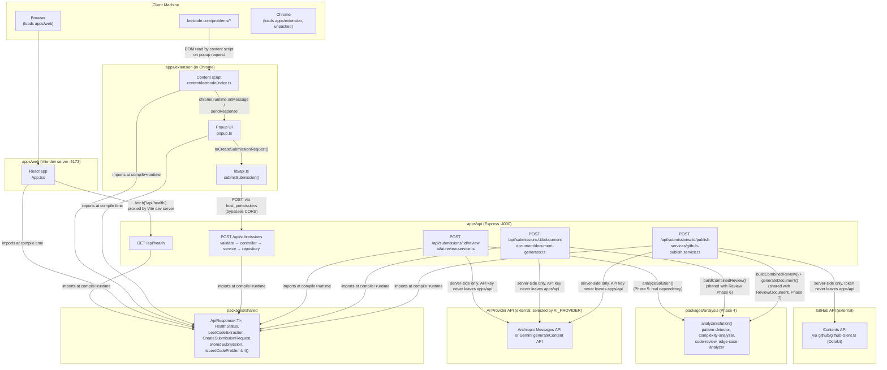
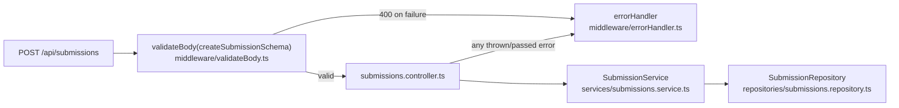
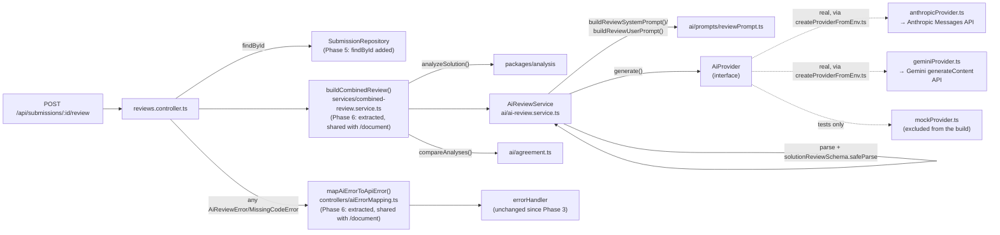
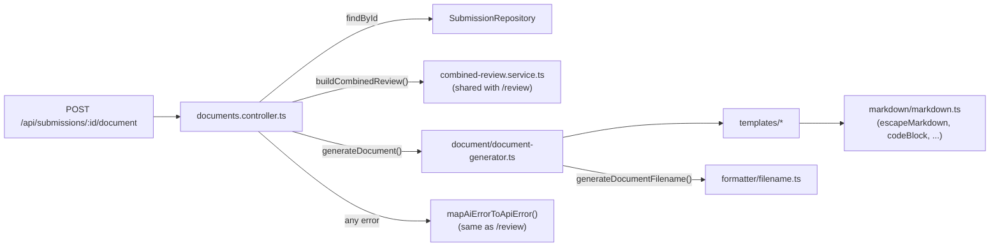
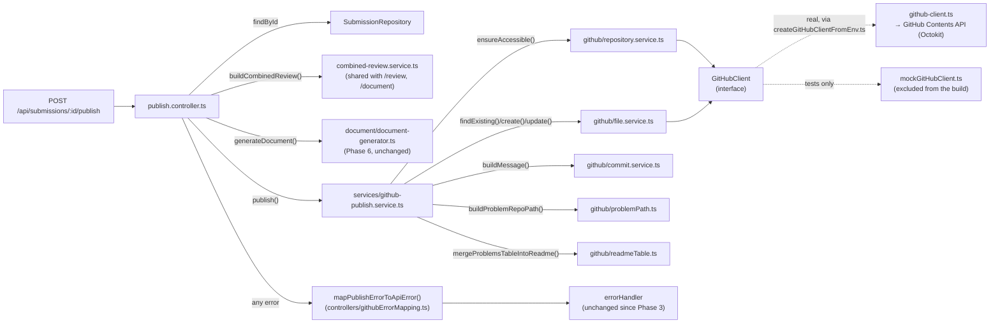
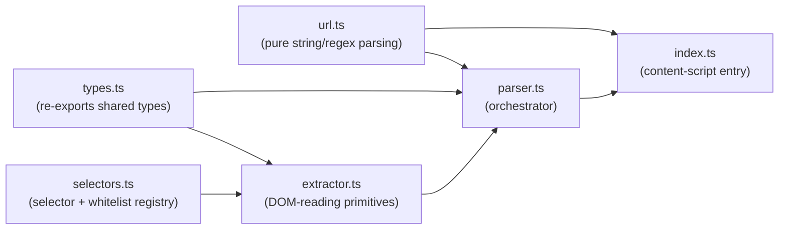
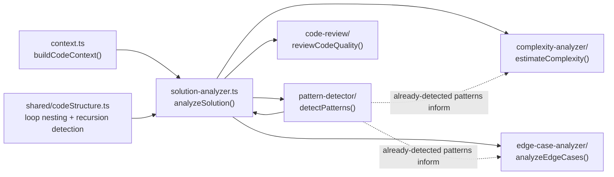

# Architecture

This document describes the system architecture as it exists **today (through Phase 7)**,
plus the planned shape of later phases for context. Sections and diagram elements are
explicitly marked as implemented or planned — nothing here should be read as already built
unless labeled so.

## System architecture (Phases 1–7 — implemented)



- **`apps/web`** is a Vite dev server serving a React SPA. Its only real behavior is calling
  the API's health endpoint and rendering the result.
- **`apps/api`** is a single Express process exposing five routes: `GET /api/health`, (Phase 3)
  `POST /api/submissions`, (Phase 5) `POST /api/submissions/:id/review`, (Phase 6)
  `POST /api/submissions/:id/document`, and (Phase 7) `POST /api/submissions/:id/publish`, all
  mounted under `/api`.
- **`packages/shared`** is a plain TypeScript package (built to `dist/` with `tsc`) that
  `apps/web`, `apps/api`, and `apps/extension` all depend on via npm workspaces, so response
  and domain shapes — including the `POST /api/submissions` wire contract — are defined once
  and consumed with full type safety everywhere.
- **`apps/extension`** builds independently (via esbuild) into `dist/` and can be loaded
  unpacked into Chrome. Its content script reads a LeetCode problem page's DOM on request; the
  popup can display that data locally (Phase 2) or send it to the API (Phase 3, via
  `lib/api.ts`).
- **`packages/analysis`** (Phase 4) is a standalone, dependency-free TypeScript package: given
  a submission's code and language, `analyzeSolution()` returns a deterministic (non-AI)
  analysis — detected algorithm patterns, estimated time/space complexity, code-quality and
  edge-case observations, each with an explicit confidence level. As of Phase 5 it's a real
  dependency of `apps/api` — see [AI review layer](#ai-review-layer-phase-5--appsapisrcai)
  below.

## Frontend (`apps/web`)

- React 19 + TypeScript, built and served by Vite.
- `src/App.tsx` is the only real component: it calls `/api/health` on mount and renders the
  result (loading / online / offline) along with the project name and phase status.
- In development, `vite.config.ts` proxies any request to `/api/*` to
  `http://localhost:4000`, so the frontend source never hardcodes the backend's origin. This
  is the mechanism that will let the frontend talk to the real API in later phases without
  code changes to the fetch calls themselves.
- Testing: Vitest + `jsdom` + React Testing Library, with `fetch` stubbed in tests so no real
  network call happens during `npm run test`.

## Backend (`apps/api`)

- Express 5 + TypeScript, entry point `src/index.ts`, app construction factored into
  `src/app.ts` (`createApp(config)`) so tests can build an app instance without binding a real
  TCP port.
- Middleware, in order: `cors` (restricted to a configurable origin) → `requestLogger` (Phase
  3 — logs method/path/status/duration once each response finishes) → `express.json()` → the
  API router → `notFoundHandler` (Phase 3 — a consistent 404 envelope for unmatched routes) →
  `errorHandler` (Phase 3 — the centralized error-to-response mapping; must stay last and keep
  all 4 parameters, since that arity is how Express recognizes error-handling middleware).
- Routes are organized under `src/routes/`, mounted at `/api` via `createApiRouter()` (a
  composition-root factory, not a module-level singleton — see below); `health.route.ts`,
  (Phase 3) `submissions.route.ts`, (Phase 5) `reviews.route.ts`, (Phase 6)
  `documents.route.ts`, and (Phase 7) `publish.route.ts`.
- Every JSON response uses the shared `ApiResponse<T>` envelope (`{ success, data }` or
  `{ success: false, error }`) from `packages/shared`, so response shape is consistent and
  typed from the first endpoint onward — including every error path, via the centralized
  error handler.
- Testing: Vitest + Supertest exercising the Express app directly (no real network I/O).

### Submission API layer (Phase 3 — `POST /api/submissions`)

Layered routes → middleware → controllers → services → repositories, with validation as its
own explicit layer:



- **`schemas/submission.schema.ts`** — a Zod schema that is the actual runtime source of truth
  for what the server accepts, independent of (and in places stricter than) the TypeScript wire
  type — see [docs/phases/phase-03.md](phases/phase-03.md#validation) for the full rule table
  and why the schema's inferred type (`ValidatedSubmissionInput`) is deliberately a distinct
  type from `@codereviewai/shared`'s `CreateSubmissionRequest`.
- **`middleware/validateBody.ts`** — a generic, reusable `validateBody<T>(schema)` factory;
  any future endpoint's Zod schema plugs in the same way.
- **`controllers/submissions.controller.ts`** — a thin Express handler: read the
  already-validated body, call the service, respond `201`, or forward errors to `next()`.
  Built as a factory (`createSubmissionsController(service)`), matching `app.ts`'s existing
  `createApp(config)` dependency-injection shape.
- **`services/submissions.service.ts`** — normalizes fields (trims whitespace, lowercases the
  slug, strips the URL's query/fragment — but never touches `submission.code` itself), assigns
  a `crypto.randomUUID()` id, records a server-assigned `receivedAt`, and persists via the
  repository interface.
- **`repositories/submissions.repository.ts`** — `SubmissionRepository` (interface) +
  `InMemorySubmissionRepository` (a `Map`-backed implementation). The service depends on the
  interface, never the concrete class, so a real database implementation can replace it later
  with no change to the service, controller, or route.
- **`routes/index.ts`** — `createApiRouter()`, a small composition root: builds a fresh
  repository → service → controller → router on every call, so every `createApp()` instance
  (including every test's) gets its own isolated in-memory store. As of Phase 5, also
  constructs the real `AiProvider` and `AiReviewService` here; as of Phase 7, also constructs
  the real `GitHubClient` and `GitHubPublishService` (see below).

### AI review layer (Phase 5 — `apps/api/src/ai/`)

`POST /api/submissions/:id/review` combines a stored submission, Phase 4's deterministic
analysis, and a new AI-generated review into one response — never merging the two analyses,
always exposing where they disagree. Full detail, including the prompt design and hallucination
mitigation strategy: [docs/ai-analysis.md](ai-analysis.md).



- **`ai/providers/types.ts`** defines the one interface (`AiProvider`) `ai-review.service.ts`
  depends on — never a concrete provider class — mirroring how services already depend on
  `SubmissionRepository`, not `InMemorySubmissionRepository` (Phase 3). Two real
  implementations exist: `ai/providers/anthropicProvider.ts` (calls Anthropic's Messages API
  directly over `fetch`, no SDK) and `ai/providers/geminiProvider.ts` (calls Google's Gemini
  `generateContent` API the same way); `ai/providers/createProviderFromEnv.ts` reads
  `AI_PROVIDER` and constructs whichever one is selected. `ai/providers/mockProvider.ts` is
  test/dev-only and is excluded from the production build (`apps/api/tsconfig.build.json`).
- **`ai/prompts/reviewPrompt.ts`** is a dedicated prompt-building module — never a prompt string
  inlined in the controller — accepting only `{ problem, submission, deterministicAnalysis }`,
  which is what makes it structurally impossible to forward a submission's `id` or `metadata` to
  the AI provider.
- **`ai/schemas/solutionReview.schema.ts`** is the Zod schema every AI response must pass —
  the AI's raw text is untrusted output, held to the same standard Phase 3 holds client request
  bodies to.
- **`ai/agreement.ts`** compares the deterministic and AI complexity/pattern claims and reports
  exactly where they match and where they diverge — the direct implementation of the task's
  "expose the disagreement rather than hiding it" requirement.
- **`ai/errors.ts`** defines one error type, `AiReviewError`, covering every AI failure mode
  (timeout, provider error, rate limit, malformed response, schema validation) —
  HTTP-agnostic; `controllers/aiErrorMapping.ts`'s `mapAiErrorToApiError()` (Phase 6, extracted
  from what was originally inlined in `reviews.controller.ts`) is the one place that translates
  it — and `services/combined-review.service.ts`'s `MissingCodeError` — to the HTTP-facing
  `ApiError`, shared by both `reviews.controller.ts` and `documents.controller.ts`.
- **`ai/ai-review.service.ts`** is the orchestrator: builds the prompt, calls the injected
  provider (racing it against its own timeout as a defense-in-depth backstop), strips a
  markdown fence if the model added one anyway, parses JSON, and validates against the schema.

### Document generation layer (Phase 6 — `apps/api/src/document/`)

`POST /api/submissions/:id/document` turns the same `CombinedSolutionReview` the review
endpoint produces (via the now-shared `buildCombinedReview()`) into a complete Markdown learning
document — problem info, the exact submitted code, the AI's approach/patterns/complexity, both
analyses' agreement or disagreement, a better-approach section when one exists, and more. Full
detail, including the document schema, escaping rules, and filename strategy:
[docs/document-generation.md](document-generation.md).



- **`document/document-generator.ts`** is the one exported entry point — the only function
  `documents.controller.ts` calls. Nothing outside `document/` builds Markdown, satisfying the
  task's "do not generate Markdown inside controllers" requirement structurally: the controller
  has no Markdown-building code available to it at all.
- **`document/markdown/markdown.ts`** is the one place that knows Markdown syntax:
  `heading()`, `bulletList()`, `blockquote()`, `codeBlock()` (dynamic fence-width selection so
  code containing its own ` ``` ` sequence can't break out), and `escapeMarkdown()` (escapes
  inline-significant characters and neutralizes leading block-structure markers — heading,
  bullet, blockquote, ordered-list, setext underline — so arbitrary AI-generated or extracted
  text can never inject document structure).
- **`document/templates/`** holds one file per section group (problem info, solution, complexity,
  review, learning), each built exclusively from `markdown/markdown.ts`'s primitives.
- **`document/formatter/filename.ts`** generates a safe, defensively-sanitized filename
  (`NNN-slug.md`) — collapses path-traversal-shaped input into ordinary hyphens rather than
  trusting Phase 3's slug validation alone.
- **`services/combined-review.service.ts`** (Phase 6, extracted from what Phase 5 originally
  inlined in `reviews.controller.ts`) is now the single place that runs
  `analyzeSolution()` → `AiReviewService.generateReview()` → `compareAnalyses()`, shared by
  `reviews.controller.ts`, `documents.controller.ts`, and (Phase 7) `publish.controller.ts` so
  none of the three can ever drift apart on how a `CombinedSolutionReview` is built.
- **The submitted code path is deliberately escaping-free.** `document-generator.ts` passes
  `submission.code` straight into `codeBlock()` with no call to `escapeMarkdown()` anywhere —
  the task's "do not modify the user's code" requirement enforced structurally, not by
  convention. The code is labeled **YOUR SOLUTION**; a populated "Better Approach" section's
  code is labeled **RECOMMENDED SOLUTION** — the two are never presented as the same thing, and
  the submitted code is never replaced.

### GitHub publishing layer (Phase 7 — `apps/api/src/github/`)

`POST /api/submissions/:id/publish` takes Phase 6's generated document and commits it to a
GitHub repository — a per-problem `README.md`, a small `problems/index.json`, and an
auto-maintained root `README.md` table — with explicit duplicate detection so a re-analyzed
problem is never silently overwritten. Full detail, including the repository layout, commit
process, and duplicate-handling contract: [docs/github-integration.md](github-integration.md).



- **`github/types.ts`** defines the one interface (`GitHubClient`) every service in `github/`
  depends on — never a concrete Octokit type — the same dependency-inversion shape as
  `ai/providers/types.ts`'s `AiProvider`. `github/github-client.ts` is the one real
  implementation (the only file that imports `@octokit/rest`), and is a **synchronous** factory
  like `createAnthropicProvider`/`createGeminiProvider`: it never eagerly fetches a token, so
  the whole API still starts cleanly with no `GITHUB_TOKEN`/`GITHUB_REPO` configured.
  `github/mockGitHubClient.ts` is test/dev-only and is excluded from the production build
  (`apps/api/tsconfig.build.json`).
- **`github/auth.ts`** defines `GitHubAuthProvider` (`getToken(): Promise<string>`), kept
  separate from `GitHubClient` specifically so a future OAuth implementation is a new file
  implementing the same interface, not a change to any request logic — see
  [docs/github-integration.md#future-oauth-design](github-integration.md#future-oauth-design).
  `createEnvTokenAuthProvider()` is the MVP implementation: a single token from `GITHUB_TOKEN`.
- **`services/github-publish.service.ts`** is the orchestrator — the one place that spans
  `github/` and Phase 6's `document/` together, mirroring `combined-review.service.ts`'s role.
  Enforces the create/update duplicate-handling contract (never a silent accidental overwrite —
  see [docs/github-integration.md#duplicate-handling](github-integration.md#duplicate-handling)),
  then keeps `problems/index.json` and the root README's table in sync, skipping any write whose
  content would be unchanged.
- **`github/readmeTable.ts`** renders the root README's table and merges it into any existing
  README between `<!-- codereviewai:problems-table:start/end -->` markers — replacing only what's
  between them, never anything else, per the task's "do not destroy manually written sections"
  requirement. Uses two primitives added to `document/markdown/markdown.ts` in this phase
  (`table()`, `tableCell()`), reusing Phase 6's `escapeMarkdown()` rather than duplicating
  escaping logic.
- **`github/commit.service.ts`** is the one place commit-message text is decided — every write
  gets a `docs:`-prefixed, problem-specific message (e.g. `"docs: add analysis for Two Sum"`),
  never a generic one, satisfying the task's "create meaningful commits" requirement.

## Chrome extension (`apps/extension`)

- Manifest V3: a background service worker (`background.js`), an action popup
  (`popup/popup.html` + `popup/popup.js`), and (Phase 2) a content script
  (`content/leetcode.js`) statically matched to `https://leetcode.com/problems/*`.
- Built with a small esbuild script (`scripts/build.mjs`) rather than Vite, because MV3
  background/popup/content bundles are small, independent entry points with no need for a dev
  server, HMR, or code-splitting — esbuild's plain `build()`/`context()` API is the more direct
  fit. Three entry points are bundled: `background`, `popup/popup`, and `content/leetcode`.
- `manifest.json` requests **zero** `permissions` and one narrowly-scoped `host_permissions`
  entry, `http://localhost:4000/*` (added in Phase 3 — see below); a statically declared
  `content_scripts.matches` entry (unchanged since Phase 2) is enough for Chrome to inject the
  content script on matching pages without a separate `host_permissions` grant for that origin.
- `src/lib/messaging.ts` defines the popup ↔ content-script request/response contract
  (`ExtractLeetCodeDataMessage` / `ExtensionResponse`) and still exposes
  `getExtensionStatusMessage()` (used by the background worker's install log).
- `src/lib/api.ts` (Phase 3) is the extension's only network-calling code: maps a
  `LeetCodeExtraction` onto the API's `CreateSubmissionRequest` wire contract and POSTs it to
  `POST /api/submissions`, returning a typed `'success' | 'validation-error' | 'error'`
  outcome rather than raw `fetch`/HTTP-status handling.

### LeetCode extraction adapter (`apps/extension/src/content/leetcode/`)

This is the dedicated, isolated module the whole extraction feature lives in — the guiding
constraint is that LeetCode's DOM/class names are not a stable public contract, so every
LeetCode-specific assumption is confined to this folder and built to degrade to `null` rather
than guess when it doesn't match.



- **`url.ts`** — a thin re-export of `isLeetCodeProblemUrl` / `extractSlugFromUrl` from
  `@codereviewai/shared` (the logic itself moved there in Phase 3 so `apps/api` can validate a
  submitted `problem.url` with the exact same check, instead of a second regex that could
  drift from this one). Pure string/regex logic, no DOM access at all — the single most
  reliable signal in the whole adapter, and the cheapest to unit test.
- **`selectors.ts`** — every CSS selector and text whitelist (`KNOWN_LANGUAGES`, the submission
  status list from `packages/shared`, the `Easy`/`Medium`/`Hard` difficulty list) in one file.
  Selectors are treated as *hints*, not guarantees.
- **`extractor.ts`** — the actual DOM-reading logic. Two strategies, chosen per field by how
  safe substring/selector matching is for that field:
  - **Exact-text whitelist matching** (`findExactTextMatch`, used for difficulty, language,
    submission status): tries the curated selectors first, then falls back to scanning every
    *leaf* element in the whole document for one whose entire trimmed text exactly equals a
    whitelist entry. This is deliberately the primary strategy, not a last resort — it's far
    more resilient to LeetCode's markup changing than any guessed selector, and safe from false
    positives because prose doesn't contain a leaf element whose only content is literally
    "Easy" or "Accepted".
  - **Scoped regex matching** (`extractRuntimeMemory`): only searches inside an already-matched
    result container, never the whole document, because substring patterns like `\d+\s?ms`
    carry real false-positive risk against arbitrary page text.
  - **Best-effort DOM join** (`extractVisibleEditorCode`): joins whatever `.view-line` elements
    Monaco currently has rendered, in document order. Explicitly best-effort — see
    [docs/phases/phase-02.md](phases/phase-02.md#14-known-limitations).
- **`parser.ts`** — `parseLeetCodeExtraction(doc, url)`, the adapter's single public entry
  point. Calls every extractor, builds the typed `LeetCodeExtraction`, and records which fields
  fell back to `null` in a `warnings` array.
- **`types.ts`** — re-exports the `LeetCode*` types from `@codereviewai/shared` so nothing
  under `content/leetcode/` imports from outside the folder for its own domain types.
- **`index.ts`** — the real content-script entry point: listens for
  `chrome.runtime.onMessage`, checks `isLeetCodeProblemUrl(window.location.href)`, and responds
  with a fresh `parseLeetCodeExtraction(document, window.location.href)` result (or an error)
  synchronously. No extraction happens automatically on page load — only on request, so the
  popup always sees the page's current state.

## Deterministic analysis engine (Phase 4 — `packages/analysis`)

A standalone workspace package (not a folder inside `apps/api`, despite the task's example tree
showing it that way — see [docs/phases/phase-04.md](phases/phase-04.md#architecture) for why):
pure functions over a submission's source text, with no HTTP, no database, and no AI call
anywhere in it.



- **`pattern-detector/`** recognizes all 19 requested algorithm patterns via a signal-based
  rule engine (`pattern-detector/engine.ts`): each pattern is a list of weighted regex/predicate
  signals, and a pattern is reported only once matched signals clear a `reportThreshold` — with
  a confidence score capped and scaled by `confidenceCap`, not a raw fraction of every possible
  signal (most signals within one rule are mutually-exclusive language alternatives, e.g. `new
  Map(` vs `HashMap<`, not independent corroborating evidence — see
  [docs/phases/phase-04.md](phases/phase-04.md#pattern-detection) for the full reasoning and the
  real confidence-model bug this phase's own tests caught and fixed).
- **`complexity-analyzer/`** estimates time and space complexity from loop-nesting depth,
  recursion, and the already-detected patterns — explicitly a heuristic *estimate*, with
  `reasoning: string[]` always stating what drove it, distinguished from LeetCode's own reported
  runtime/memory (`StoredSubmission.submission.runtime`/`.memory`, from Phase 3 — this module
  never reads or touches those fields).
- **`code-review/`** and **`edge-case-analyzer/`** flag style/maintainability concerns
  (nested loops, naming, duplication, mutation, ...) and input-robustness concerns (missing
  empty/null guards, unchecked set insertion, no visible recursion base case) respectively —
  deliberately kept as two separate modules rather than one, so overlapping concerns (like
  "suspicious edge cases," listed under the task's Code Quality section) have exactly one
  analyzer responsible for them.
- **`solution-analyzer.ts`** is the one public entry point, `analyzeSolution({ code, language })`
  → `SolutionAnalysis`, combining every module's output plus a synthesized `possibleIssues`
  digest and an overall `confidence` (the average of every sub-confidence produced — not a
  separate guess).

Every field this engine returns is derived purely from the submitted source text — there is no
execution, no AST, and (per this phase's explicit scope) no network call or AI provider
anywhere in it.

## Shared package (`packages/shared`)

- Plain TypeScript, compiled with `tsc` to `dist/` (`main`/`types` in its `package.json` point
  there), consumed by `apps/web`, `apps/api`, and `apps/extension` as a normal npm-workspace
  dependency.
- Contents: `ApiResponse<T>` / `ApiSuccess<T>` / `ApiError` (the envelope every endpoint uses,
  extended in Phase 3 with an optional `error.details` for validation issues) and
  `HealthStatus` (the health-check payload), three small pure helper functions (`success`,
  `failure`, `isSuccess`), (Phase 2) `LeetCodeExtraction` / `LeetCodeProblemInfo` /
  `LeetCodeSubmissionInfo` / `LeetCodeDifficulty` / `LeetCodeSubmissionStatus` /
  `LeetCodeLanguage` — the shape the extension's extractor produces — and (Phase 3)
  `CreateSubmissionRequest` / `StoredSubmission` (the `POST /api/submissions` wire contract,
  reusing the Phase 2 types as-is) plus `isLeetCodeProblemUrl` / `extractSlugFromUrl` (moved
  here from the extension so the API validates a submitted URL with the same logic the
  extension uses to detect a problem page). All of this lives in `packages/shared` rather than
  staying app-internal because more than one app needs the exact same contract, and a single
  source of truth is what keeps them from drifting apart.

## Future: OAuth-based GitHub authentication (not implemented)

GitHub publishing itself (Phase 7, above) is done — token-based auth, repository lookup,
duplicate detection, and commits all work today via `GITHUB_TOKEN`. What remains is swapping
that single, manually-issued personal access token for a proper OAuth flow (a user authorizes a
GitHub App or OAuth App from within the product, rather than pasting a token into `.env`) —
planned for whenever the project adds user accounts (Phase 9+). `github/auth.ts`'s
`GitHubAuthProvider` interface was built specifically to make this a new implementation of that
interface, not a change to `github-client.ts` or anything above it — see
[docs/github-integration.md#future-oauth-design](github-integration.md#future-oauth-design)
for a concrete sketch of what that implementation would look like.

## Data flow

**Implemented today:**

```
Browser → apps/web (Vite) → fetch /api/health → apps/api (Express) → HealthStatus JSON

leetcode.com/problems/<slug> → content script (on popup request)
                              → parseLeetCodeExtraction(document, url)
                              → LeetCodeExtraction JSON → rendered in the popup

leetcode.com/problems/<slug> → content script → popup ("Submit Solution")
                              → toCreateSubmissionRequest() → POST /api/submissions
                              → validateBody(schema) → controller → service → repository
                              → 201 StoredSubmission JSON → rendered in the popup

POST /api/submissions/:id/review
  → reviews.controller.ts: repository.findById(id) (404 if missing)
  → buildCombinedReview(): analyzeSolution() (packages/analysis) → SolutionAnalysis, recomputed fresh
                          → AiReviewService.generateReview() → prompt → AiProvider → validated SolutionReview
                          → compareAnalyses(deterministic, ai) → ReviewAgreement
  → 200 CombinedSolutionReview JSON { deterministic, ai, agreement, generatedAt }

POST /api/submissions/:id/document
  → documents.controller.ts: repository.findById(id) (404 if missing)
  → buildCombinedReview() (same helper as /review, above)
  → generateDocument({ problem, submission, review }) → templates/* → markdown/*
  → 200 GeneratedDocument JSON { filename, content }

POST /api/submissions/:id/publish
  → publish.controller.ts: repository.findById(id) (404 if missing)
  → buildCombinedReview() + generateDocument() (identical to /document, above)
  → GitHubPublishService.publish():
       repository.service.ts: ensureAccessible() (repository lookup)
       file.service.ts: findExisting(problemPath) (duplicate detection)
       → create()/update() the problem README (commit 1)
       → upsert problems/index.json (commit 2)
       → re-render + merge the root README table (commit 3)
  → 200 PublishResult JSON { status, path, commitUrl, index, readme }
```

`packages/analysis`'s `analyzeSolution()` is called from one place now — `buildCombinedReview()`
(`services/combined-review.service.ts`), shared by all three endpoints above since Phase 6
extracted it out of `reviews.controller.ts` — see [docs/ai-analysis.md](ai-analysis.md) for
the full AI review pipeline, [docs/document-generation.md](document-generation.md) for the
document pipeline, and [docs/github-integration.md](github-integration.md) for the publish
pipeline.

**Planned, once all phases are built:**

```
LeetCode page → apps/extension → apps/api → AI review → Markdown document → GitHub API
                                     ↓
                                apps/web dashboard (reads stored submissions/documents)
```

Every step in that line is now implemented end-to-end (Phases 3–7) — what's still missing is
what triggers it: nothing outside `apps/api` calls `POST /api/submissions/:id/review`,
`.../document`, or `.../publish` yet, since the extension and web frontend have no UI for
triggering any of them. A web dashboard reading stored submissions/reviews/documents back also
needs real persistence first (`InMemorySubmissionRepository` doesn't survive a restart) — see the
README's [Known Limitations](../README.md#27-known-limitations) and roadmap for what's still
unscheduled.

## Security boundaries

- **Client-side code never holds secrets.** `apps/web` and `apps/extension` ship to the
  browser; any credential (AI provider key, GitHub token) must live only in `apps/api`'s
  environment, never in frontend/extension bundles or source. As of Phase 5 this is a real,
  verified property for the AI provider key, not just a stated intention: `AI_PROVIDER_API_KEY`
  is read exactly once, server-side, in `ai/providers/createProviderFromEnv.ts` (called from
  `routes/index.ts`) when constructing the real provider (Anthropic or Gemini, per
  `AI_PROVIDER`) — no HTTP response ever includes it, and neither `apps/web` nor
  `apps/extension` has any code path that could read it.
- **The GitHub token gets the same verified treatment, as of Phase 7.** `GITHUB_TOKEN` is read
  exactly once, server-side, in `github/auth.ts`'s `createEnvTokenAuthProvider()` (constructed
  by `github/createGitHubClientFromEnv.ts`, called from `routes/index.ts`) — never hardcoded,
  never logged, never included in any HTTP response (`PublishResult` carries a `commitUrl`, not
  the token), and unreachable from `apps/web`/`apps/extension`. See
  [docs/github-integration.md#authentication-and-token-handling](github-integration.md#authentication-and-token-handling).
- **The AI request contains exactly what's needed to review the code, and nothing else.**
  `ai/prompts/reviewPrompt.ts`'s input type accepts only `{ problem, submission,
  deterministicAnalysis }` — the submission's `id`, `metadata.receivedAt`, `metadata.extractedAt`,
  and `metadata.source` are never sent to the AI provider, since none of them would improve the
  review. See [docs/ai-analysis.md#privacy](ai-analysis.md#privacy).
- **AI output is untrusted, exactly like client input is.** A raw AI response is not treated as
  ground truth anywhere in the system: it must pass `solutionReviewSchema` (Zod) before it's
  used, and its complexity/pattern claims are explicitly compared against — not blindly
  substituted for — Phase 4's independently-computed deterministic analysis. See
  [docs/ai-analysis.md](ai-analysis.md) for the full validation and hallucination-mitigation
  strategy.
- **Generated documents can't be used to inject Markdown structure.** Every piece of dynamic
  prose embedded in a Phase 6 document (problem descriptions, every AI-generated string) is run
  through `document/markdown/markdown.ts`'s `escapeMarkdown()`, which neutralizes leading
  heading/list/blockquote/code-fence markers and escapes inline-significant characters — an AI
  response or extracted problem description can never inject a rogue heading, list item, or
  break out of a fenced code block. See
  [docs/document-generation.md#escaping](document-generation.md#escaping).
- **CORS is restricted**, not wide open — `apps/api` only accepts requests from the origin in
  `CORS_ORIGIN` (defaults to the local Vite dev server).
- **The extension requests least privilege.** Its content-script page access comes entirely
  from `content_scripts.matches`, scoped to `https://leetcode.com/problems/*`. Its one
  `host_permissions` entry (Phase 3) is scoped to exactly `http://localhost:4000/*` — never a
  broad `<all_urls>` grant — and exists solely so the popup can POST to the local dev API
  without being blocked by CORS (an MV3 extension with a declared `host_permissions` grant for
  an origin is trusted for that origin regardless of the server's own CORS headers; this is
  why `apps/api`'s `CORS_ORIGIN` config did **not** need to change to accommodate the
  extension). A real deployment will need this value updated to the API's real origin.
- **No invented data.** The extractor returns `null` for any field it can't find reliably
  (exact-text whitelist matching, scoped regex matching, or a stable fallback like
  `document.title`/a meta tag) instead of guessing — this is a correctness property, but it's
  also a data-integrity/trust boundary: nothing downstream should ever receive a fabricated
  value. The API (Phase 3) independently enforces the same principle server-side: it never
  trusts that a client-side type was honored, and validates every field's shape *and* business
  meaning (a URL must actually be a LeetCode problem URL, not just URL-shaped; a language must
  be an exact whitelist member, not just a string) via its own Zod schema.
- **The API never trusts client input, or a client's own timestamp.** Every field is validated
  server-side independent of the TypeScript wire type (see
  [docs/phases/phase-03.md](phases/phase-03.md#validation)), and the server records its own
  `metadata.receivedAt` rather than relying solely on the client-supplied
  `metadata.extractedAt`.
- **Submitted code is stored, never executed.** Nothing in `apps/api` parses or runs any part
  of a submitted payload — it's opaque string data throughout the request/storage path. The
  Phase 4 analysis engine (`packages/analysis`) is held to the same rule: every check is a
  regex/text heuristic over the source string, never an `eval`, a sandboxed execution, or
  anything that runs submitted code. The Phase 5 AI review layer sends the code as text in a
  prompt and receives text back — it never executes it either, and this system has no sandbox
  or code-execution capability anywhere in it. Phase 6's document generator embeds that same
  code, byte-for-byte, inside a Markdown fence — displayed, never executed or evaluated by
  anything in this codebase.
- **`.env` files are never committed** — `.gitignore` excludes all `.env*` files, and
  `.env.example` documents variable *names* only, with no real values.
- **GitHub writes are scoped and explicit, as of Phase 7.** `GITHUB_REPO` names exactly one
  repository the user explicitly configures — never an arbitrary or inferred location — and
  every write goes through `github/problemPath.ts`'s sanitized path-building, which collapses
  path-traversal-shaped input (`../`, `/`, `\`) into ordinary hyphens the same way Phase 6's
  filename generator does, so a malformed slug can never write outside `problems/`.
- **A duplicate is never silently overwritten.** `GitHubPublishService` rejects a `"create"`-mode
  publish against a problem that already exists (`409 GITHUB_CONFLICT`) rather than overwriting
  it — an intentional overwrite requires the caller to explicitly pass `mode: "update"`. See
  [docs/github-integration.md#duplicate-handling](github-integration.md#duplicate-handling).
