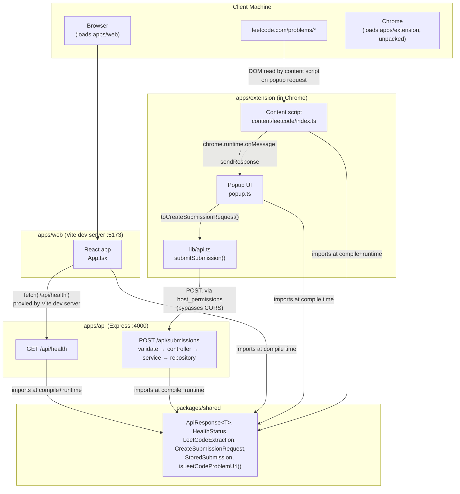
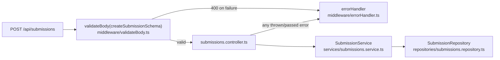
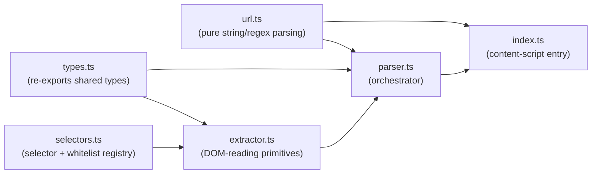

# Architecture

This document describes the system architecture as it exists **today (through Phase 3)**,
plus the planned shape of later phases for context. Sections and diagram elements are
explicitly marked as implemented or planned — nothing here should be read as already built
unless labeled so.

## System architecture (Phases 1–3 — implemented)



- **`apps/web`** is a Vite dev server serving a React SPA. Its only real behavior is calling
  the API's health endpoint and rendering the result.
- **`apps/api`** is a single Express process exposing two routes: `GET /api/health` and (Phase
  3) `POST /api/submissions`, both mounted under `/api`.
- **`packages/shared`** is a plain TypeScript package (built to `dist/` with `tsc`) that
  `apps/web`, `apps/api`, and `apps/extension` all depend on via npm workspaces, so response
  and domain shapes — including the `POST /api/submissions` wire contract — are defined once
  and consumed with full type safety everywhere.
- **`apps/extension`** builds independently (via esbuild) into `dist/` and can be loaded
  unpacked into Chrome. Its content script reads a LeetCode problem page's DOM on request; the
  popup can display that data locally (Phase 2) or send it to the API (Phase 3, via
  `lib/api.ts`).

## Frontend (`apps/web`)

- React 19 + TypeScript, built and served by Vite.
- `src/App.tsx` is the only real component: it calls `/api/health` on mount and renders the
  result (loading / online / offline) along with the project name and phase status.
- In development, `vite.config.ts` proxies any request to `/api/*` to
  `http://localhost:4000`, so the frontend source never hardcodes the backend's origin. This
  is the mechanism that will let the frontend talk to the real API in later phases without
  code changes to the fetch calls themselves.
- Testing: Vitest + `jsdom` + React Testing Library, with `fetch` stubbed in tests so no real
  network call happens during `npm run test`.

## Backend (`apps/api`)

- Express 5 + TypeScript, entry point `src/index.ts`, app construction factored into
  `src/app.ts` (`createApp(config)`) so tests can build an app instance without binding a real
  TCP port.
- Middleware, in order: `cors` (restricted to a configurable origin) → `requestLogger` (Phase
  3 — logs method/path/status/duration once each response finishes) → `express.json()` → the
  API router → `notFoundHandler` (Phase 3 — a consistent 404 envelope for unmatched routes) →
  `errorHandler` (Phase 3 — the centralized error-to-response mapping; must stay last and keep
  all 4 parameters, since that arity is how Express recognizes error-handling middleware).
- Routes are organized under `src/routes/`, mounted at `/api` via `createApiRouter()` (a
  composition-root factory, not a module-level singleton — see below); `health.route.ts` and
  (Phase 3) `submissions.route.ts`.
- Every JSON response uses the shared `ApiResponse<T>` envelope (`{ success, data }` or
  `{ success: false, error }`) from `packages/shared`, so response shape is consistent and
  typed from the first endpoint onward — including every error path, via the centralized
  error handler.
- Testing: Vitest + Supertest exercising the Express app directly (no real network I/O).

### Submission API layer (Phase 3 — `POST /api/submissions`)

Layered routes → middleware → controllers → services → repositories, with validation as its
own explicit layer:



- **`schemas/submission.schema.ts`** — a Zod schema that is the actual runtime source of truth
  for what the server accepts, independent of (and in places stricter than) the TypeScript wire
  type — see [docs/phases/phase-03.md](phases/phase-03.md#validation) for the full rule table
  and why the schema's inferred type (`ValidatedSubmissionInput`) is deliberately a distinct
  type from `@codereviewai/shared`'s `CreateSubmissionRequest`.
- **`middleware/validateBody.ts`** — a generic, reusable `validateBody<T>(schema)` factory;
  any future endpoint's Zod schema plugs in the same way.
- **`controllers/submissions.controller.ts`** — a thin Express handler: read the
  already-validated body, call the service, respond `201`, or forward errors to `next()`.
  Built as a factory (`createSubmissionsController(service)`), matching `app.ts`'s existing
  `createApp(config)` dependency-injection shape.
- **`services/submissions.service.ts`** — normalizes fields (trims whitespace, lowercases the
  slug, strips the URL's query/fragment — but never touches `submission.code` itself), assigns
  a `crypto.randomUUID()` id, records a server-assigned `receivedAt`, and persists via the
  repository interface.
- **`repositories/submissions.repository.ts`** — `SubmissionRepository` (interface) +
  `InMemorySubmissionRepository` (a `Map`-backed implementation). The service depends on the
  interface, never the concrete class, so a real database implementation can replace it later
  with no change to the service, controller, or route.
- **`routes/index.ts`** — `createApiRouter()`, a small composition root: builds a fresh
  repository → service → controller → router on every call, so every `createApp()` instance
  (including every test's) gets its own isolated in-memory store.

## Chrome extension (`apps/extension`)

- Manifest V3: a background service worker (`background.js`), an action popup
  (`popup/popup.html` + `popup/popup.js`), and (Phase 2) a content script
  (`content/leetcode.js`) statically matched to `https://leetcode.com/problems/*`.
- Built with a small esbuild script (`scripts/build.mjs`) rather than Vite, because MV3
  background/popup/content bundles are small, independent entry points with no need for a dev
  server, HMR, or code-splitting — esbuild's plain `build()`/`context()` API is the more direct
  fit. Three entry points are bundled: `background`, `popup/popup`, and `content/leetcode`.
- `manifest.json` requests **zero** `permissions` and one narrowly-scoped `host_permissions`
  entry, `http://localhost:4000/*` (added in Phase 3 — see below); a statically declared
  `content_scripts.matches` entry (unchanged since Phase 2) is enough for Chrome to inject the
  content script on matching pages without a separate `host_permissions` grant for that origin.
- `src/lib/messaging.ts` defines the popup ↔ content-script request/response contract
  (`ExtractLeetCodeDataMessage` / `ExtensionResponse`) and still exposes
  `getExtensionStatusMessage()` (used by the background worker's install log).
- `src/lib/api.ts` (Phase 3) is the extension's only network-calling code: maps a
  `LeetCodeExtraction` onto the API's `CreateSubmissionRequest` wire contract and POSTs it to
  `POST /api/submissions`, returning a typed `'success' | 'validation-error' | 'error'`
  outcome rather than raw `fetch`/HTTP-status handling.

### LeetCode extraction adapter (`apps/extension/src/content/leetcode/`)

This is the dedicated, isolated module the whole extraction feature lives in — the guiding
constraint is that LeetCode's DOM/class names are not a stable public contract, so every
LeetCode-specific assumption is confined to this folder and built to degrade to `null` rather
than guess when it doesn't match.



- **`url.ts`** — a thin re-export of `isLeetCodeProblemUrl` / `extractSlugFromUrl` from
  `@codereviewai/shared` (the logic itself moved there in Phase 3 so `apps/api` can validate a
  submitted `problem.url` with the exact same check, instead of a second regex that could
  drift from this one). Pure string/regex logic, no DOM access at all — the single most
  reliable signal in the whole adapter, and the cheapest to unit test.
- **`selectors.ts`** — every CSS selector and text whitelist (`KNOWN_LANGUAGES`, the submission
  status list from `packages/shared`, the `Easy`/`Medium`/`Hard` difficulty list) in one file.
  Selectors are treated as *hints*, not guarantees.
- **`extractor.ts`** — the actual DOM-reading logic. Two strategies, chosen per field by how
  safe substring/selector matching is for that field:
  - **Exact-text whitelist matching** (`findExactTextMatch`, used for difficulty, language,
    submission status): tries the curated selectors first, then falls back to scanning every
    *leaf* element in the whole document for one whose entire trimmed text exactly equals a
    whitelist entry. This is deliberately the primary strategy, not a last resort — it's far
    more resilient to LeetCode's markup changing than any guessed selector, and safe from false
    positives because prose doesn't contain a leaf element whose only content is literally
    "Easy" or "Accepted".
  - **Scoped regex matching** (`extractRuntimeMemory`): only searches inside an already-matched
    result container, never the whole document, because substring patterns like `\d+\s?ms`
    carry real false-positive risk against arbitrary page text.
  - **Best-effort DOM join** (`extractVisibleEditorCode`): joins whatever `.view-line` elements
    Monaco currently has rendered, in document order. Explicitly best-effort — see
    [docs/phases/phase-02.md](phases/phase-02.md#14-known-limitations).
- **`parser.ts`** — `parseLeetCodeExtraction(doc, url)`, the adapter's single public entry
  point. Calls every extractor, builds the typed `LeetCodeExtraction`, and records which fields
  fell back to `null` in a `warnings` array.
- **`types.ts`** — re-exports the `LeetCode*` types from `@codereviewai/shared` so nothing
  under `content/leetcode/` imports from outside the folder for its own domain types.
- **`index.ts`** — the real content-script entry point: listens for
  `chrome.runtime.onMessage`, checks `isLeetCodeProblemUrl(window.location.href)`, and responds
  with a fresh `parseLeetCodeExtraction(document, window.location.href)` result (or an error)
  synchronously. No extraction happens automatically on page load — only on request, so the
  popup always sees the page's current state.

## Shared package (`packages/shared`)

- Plain TypeScript, compiled with `tsc` to `dist/` (`main`/`types` in its `package.json` point
  there), consumed by `apps/web`, `apps/api`, and `apps/extension` as a normal npm-workspace
  dependency.
- Contents: `ApiResponse<T>` / `ApiSuccess<T>` / `ApiError` (the envelope every endpoint uses,
  extended in Phase 3 with an optional `error.details` for validation issues) and
  `HealthStatus` (the health-check payload), three small pure helper functions (`success`,
  `failure`, `isSuccess`), (Phase 2) `LeetCodeExtraction` / `LeetCodeProblemInfo` /
  `LeetCodeSubmissionInfo` / `LeetCodeDifficulty` / `LeetCodeSubmissionStatus` /
  `LeetCodeLanguage` — the shape the extension's extractor produces — and (Phase 3)
  `CreateSubmissionRequest` / `StoredSubmission` (the `POST /api/submissions` wire contract,
  reusing the Phase 2 types as-is) plus `isLeetCodeProblemUrl` / `extractSlugFromUrl` (moved
  here from the extension so the API validates a submitted URL with the same logic the
  extension uses to detect a problem page). All of this lives in `packages/shared` rather than
  staying app-internal because more than one app needs the exact same contract, and a single
  source of truth is what keeps them from drifting apart.

## Future AI layer (not implemented)

Planned to live inside `apps/api` as a new module (e.g. `src/ai/`) that:

1. Accepts a problem description + submitted source code.
2. Sends a structured prompt to an LLM provider (credentials via `AI_PROVIDER_API_KEY`,
   already documented as a placeholder in `.env.example`).
3. Parses the response into a typed analysis result (pattern, correctness explanation,
   complexity, weaknesses, suggestions, optimal-approach comparison) — a new shared type in
   `packages/shared` at that point.

This keeps the AI provider fully server-side; neither the extension nor the frontend will ever
hold an AI provider API key.

## Future GitHub layer (not implemented)

Planned to live inside `apps/api` as a new module (e.g. `src/github/`) that:

1. Renders an analysis result into a Markdown learning document.
2. Authenticates to GitHub using a server-side credential (`GITHUB_TOKEN` /
   `GITHUB_REPO`, already documented as placeholders in `.env.example`).
3. Creates or updates a file in the configured repository via the GitHub REST API.

Like the AI layer, the GitHub credential stays server-side only.

## Data flow

**Implemented today:**

```
Browser → apps/web (Vite) → fetch /api/health → apps/api (Express) → HealthStatus JSON

leetcode.com/problems/<slug> → content script (on popup request)
                              → parseLeetCodeExtraction(document, url)
                              → LeetCodeExtraction JSON → rendered in the popup

leetcode.com/problems/<slug> → content script → popup ("Submit Solution")
                              → toCreateSubmissionRequest() → POST /api/submissions
                              → validateBody(schema) → controller → service → repository
                              → 201 StoredSubmission JSON → rendered in the popup
```

**Planned, once all phases are built:**

```
LeetCode page → apps/extension → apps/api → AI layer → Markdown document → GitHub API
                                     ↓
                                apps/web dashboard (reads stored submissions/documents)
```

## Security boundaries

- **Client-side code never holds secrets.** `apps/web` and `apps/extension` ship to the
  browser; any credential (AI provider key, GitHub token) must live only in `apps/api`'s
  environment, never in frontend/extension bundles or source.
- **CORS is restricted**, not wide open — `apps/api` only accepts requests from the origin in
  `CORS_ORIGIN` (defaults to the local Vite dev server).
- **The extension requests least privilege.** Its content-script page access comes entirely
  from `content_scripts.matches`, scoped to `https://leetcode.com/problems/*`. Its one
  `host_permissions` entry (Phase 3) is scoped to exactly `http://localhost:4000/*` — never a
  broad `<all_urls>` grant — and exists solely so the popup can POST to the local dev API
  without being blocked by CORS (an MV3 extension with a declared `host_permissions` grant for
  an origin is trusted for that origin regardless of the server's own CORS headers; this is
  why `apps/api`'s `CORS_ORIGIN` config did **not** need to change to accommodate the
  extension). A real deployment will need this value updated to the API's real origin.
- **No invented data.** The extractor returns `null` for any field it can't find reliably
  (exact-text whitelist matching, scoped regex matching, or a stable fallback like
  `document.title`/a meta tag) instead of guessing — this is a correctness property, but it's
  also a data-integrity/trust boundary: nothing downstream should ever receive a fabricated
  value. The API (Phase 3) independently enforces the same principle server-side: it never
  trusts that a client-side type was honored, and validates every field's shape *and* business
  meaning (a URL must actually be a LeetCode problem URL, not just URL-shaped; a language must
  be an exact whitelist member, not just a string) via its own Zod schema.
- **The API never trusts client input, or a client's own timestamp.** Every field is validated
  server-side independent of the TypeScript wire type (see
  [docs/phases/phase-03.md](phases/phase-03.md#validation)), and the server records its own
  `metadata.receivedAt` rather than relying solely on the client-supplied
  `metadata.extractedAt`.
- **Submitted code is stored, never executed.** Nothing in `apps/api` parses or runs any part
  of a submitted payload — it's opaque string data throughout the request/storage path.
- **`.env` files are never committed** — `.gitignore` excludes all `.env*` files, and
  `.env.example` documents variable *names* only, with no real values.
- **Future GitHub writes are scoped and explicit.** The GitHub integration (Phase 7) will
  write only to a repository the user explicitly configures, not an arbitrary or inferred
  location.
