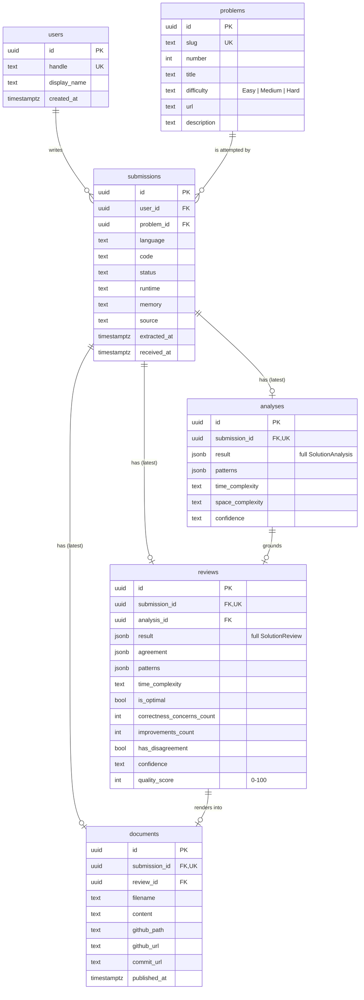

# Database

Phase 8 introduces PostgreSQL as the persistence layer behind the dashboard. This document
explains the schema, the relationships between tables, the indexes, why each table exists,
how migrations work, and the analytics rules (quality score, streaks, pattern normalization)
that turn stored rows into the dashboard's numbers. For the dashboard's endpoints, see
[docs/api.md](api.md#dashboard-endpoints). For the full phase record, see
[docs/phases/phase-08.md](phases/phase-08.md).

**The database is optional.** With no `DATABASE_URL` the API behaves exactly as it did through
Phase 7: submissions live in memory, nothing is recorded, and the dashboard endpoints answer
`503 DATABASE_NOT_CONFIGURED`. Every pre-Phase-8 test still runs in this mode.

## Schema



(`schema_migrations` — the migration bookkeeping table — is omitted from the diagram.)

## Why each table exists

| Table | Why it exists |
| --- | --- |
| `users` | Every submission belongs to a user. There is no authentication yet, so migration `001` seeds one built-in user (`local`, id `00000000-0000-0000-0000-000000000001`) that every row belongs to. Modelling `users` now means a future phase adds *login*, not a schema rewrite: `user_id` is already on `submissions`, and every repository query is already scoped by it. |
| `problems` | A LeetCode problem is a fact about LeetCode, not about a submission. Re-submitting "Two Sum" ten times must not create ten copies of its title/difficulty/description, and per-problem questions ("which problems have I attempted?") need one row per problem. Upserted by `slug` (the natural key), so the newest extracted metadata wins. |
| `submissions` | One attempt: the exact code, language, status, runtime, memory, and when it arrived. Many per problem — the history of attempts is preserved even though the dashboard shows the latest. Replaces the in-memory `InMemorySubmissionRepository` (same `SubmissionRepository` interface, so nothing above it changed). |
| `analyses` | Phase 4's deterministic result for a submission. Stored as full `jsonb` (so the detail page can show everything) **and** as real columns for what the dashboard queries (`patterns`, complexities, confidence). |
| `reviews` | Phase 5's AI review plus its agreement with the analysis. Full `jsonb` for the detail page; real columns for aggregation (`is_optimal`, `quality_score`, `patterns`, counts). Separate from `analyses` because they have different origins, costs, and lifecycles: a review can be regenerated without redoing the free static analysis, and the dashboard must be able to show a submission that has neither. |
| `documents` | Phase 6's generated Markdown and Phase 7's GitHub publication (`github_path`, `github_url`, `commit_url`, `published_at`). The dashboard's "GitHub document" link comes from here. |

**One latest row per submission** — `analyses`, `reviews`, and `documents` each have a `UNIQUE`
constraint on `submission_id`, and re-running a review/document/publish *replaces* the row
(`INSERT … ON CONFLICT (submission_id) DO UPDATE`). The dashboard only ever needs the latest,
and one-per-submission keeps every dashboard query a plain join. The trade-off is that a
regenerated review overwrites the previous one — review *history* is a possible future
addition (see [Limitations](#limitations)).

## Relationships and deletion

- `submissions.user_id → users.id` and `submissions.problem_id → problems.id`, both
  `ON DELETE CASCADE`.
- `analyses`/`reviews`/`documents.submission_id → submissions.id`, `ON DELETE CASCADE` — deleting a
  submission deletes everything derived from it.
- `reviews.analysis_id → analyses.id` and `documents.review_id → reviews.id`, `ON DELETE SET NULL`
  — these are provenance links, not ownership, so losing the parent never deletes the child.
- Check constraints reject impossible data at the database boundary, independent of the
  application: `difficulty IN ('Easy','Medium','Hard')`, `confidence IN ('low','medium','high')`,
  `quality_score BETWEEN 0 AND 100`, and non-negative counts.

## Indexes

| Index | Serves |
| --- | --- |
| `problems(slug)` (unique) | The upsert on every submission (`ON CONFLICT (slug)`). |
| `problems(number)`, `problems(difficulty)` | Problem-list sorting/filtering by number and difficulty. |
| `submissions(user_id, received_at DESC)` | Streaks (every submission date for a user) and "recent". |
| `submissions(problem_id, received_at DESC)` | `SELECT DISTINCT ON (problem_id) … ORDER BY problem_id, received_at DESC` — "the latest submission per problem", the dashboard's core query. |
| `submissions(user_id, status)` | Status filtering and accepted counts. |
| `analyses(submission_id)`, `reviews(submission_id)`, `documents(submission_id)` (unique) | The left joins from `submissions`, and the one-latest-row guarantee. |
| `analyses(patterns)`, `reviews(patterns)` — **GIN** | Pattern containment queries on the `jsonb` pattern arrays (`patterns @> '["Hash Map"]'`). The current dashboard aggregates in application code, so these are for direct SQL and future server-side pattern queries. |
| `reviews(quality_score)` | Ranking/filtering by quality. |

At personal scale (hundreds of submissions) none of these are load-bearing — every query would
be fast unindexed. They document the access patterns and keep those queries cheap if the
dataset grows.

## Why `jsonb` *and* real columns

Each analysis/review is stored twice on purpose. The **full JSON** (`result`) means the problem
detail page can show every field the AI or the analyzer produced — including fields added in
future phases — without a migration per field. The **extracted columns** (patterns, complexity,
`is_optimal`, `quality_score`, counts) are what the dashboard aggregates and sorts, so those
queries never have to reach inside JSON. `patterns` is `jsonb` rather than `text[]` so both the
`pg` driver and PGlite serialize it identically and it can carry a GIN index.

## Using Supabase

Supabase is hosted PostgreSQL, so it works through the same `DATABASE_URL` — no code path is
Supabase-specific except two small things:

1. **Setup.** Create a project, then copy Project Settings → Database → Connection string (URI) into
   `DATABASE_URL` in `apps/api/.env` (gitignored), with your database password. Use the direct
   connection (port 5432) or the Session pooler if your network is IPv4-only. Restart the API;
   migrations run at startup. The Transaction pooler (port 6543) also works — the `pg` driver used here
   sends no named prepared statements.
2. **TLS is on by default** for `*.supabase.co` / `*.supabase.com` hosts (`shouldUseSsl` in
   `persistence/createDatabaseFromEnv.ts`); `DATABASE_SSL=false` forces it off.
   Certificates are not verified (`rejectUnauthorized: false`), as for any hosted Postgres here.
3. **Row Level Security (migration `002`).** Supabase exposes `public` tables through its REST API to
   anyone holding the public anon key. Migration `002_enable_row_level_security` enables RLS on every
   table with **no policies**, so that route returns nothing and submitted code stays private. The
   API itself connects directly with the database role, which is unaffected. Do not add permissive
   policies, and keep the anon key and `service_role` key out of this project entirely — the API
   uses only `DATABASE_URL`, and the browser never talks to Supabase.

Not verified: no real Supabase project was available here, so this was tested only by unit tests
of the SSL rule and the migration on PGlite. Run the API once against your project and check
`GET /api/dashboard/summary` returns 200.

## Migrations

Migrations are TypeScript modules in `apps/api/src/persistence/migrations/` (each exports
`{ id, name, sql }`), listed in order in `migrations/index.ts`. `persistence/migrate.ts`'s
`runMigrations(db)`:

1. ensures the `schema_migrations` table exists,
2. reads which ids are already applied,
3. applies each pending migration **in id order, in its own transaction**, recording it in
   `schema_migrations` in that same transaction — so a failing migration leaves no partial schema
   and is not recorded,
4. is **idempotent**: a second run applies nothing.

They run automatically when the API starts with `DATABASE_URL` set (`index.ts`), and on demand:

```bash
npm run db:migrate -w @codereviewai/api          # from source (tsx)
npm run db:migrate:built -w @codereviewai/api    # from the compiled build
```

Rules: add a new migration by appending a new module with the next id; never edit or reorder
one that has been applied. Migrations are TypeScript rather than loose `.sql` files so `tsc`
bundles them into `dist/` with no copy step. There is no `down` migration — this project rolls
forward.

## Configuration and secrets

- `DATABASE_URL` (optional) and `DATABASE_SSL=true` (for TLS-only hosts) are read once, in
  `persistence/createDatabaseFromEnv.ts`, and passed to `pg`. **No credential is stored in the
  repository:** `.env` is gitignored, `.env.example` documents names only, and
  `docker-compose.yml` reads `POSTGRES_PASSWORD` from your environment and refuses to start
  without it (`${POSTGRES_PASSWORD:?…}`).
- The connection string is never logged, and neither are SQL parameters (they contain submitted
  code): recording failures log only an error *message*.
- SQL is always parameterized (`$1, $2, …`); no value is ever concatenated into a statement. The
  only interpolated value anywhere is the fixed seed user id constant inside migration `001`.

## Code layout

```
apps/api/src/persistence/
├── database.ts                    Database interface — the only thing repositories depend on
├── pgDatabase.ts                  Real implementation (`pg`) — the only file importing `pg`
├── pgliteDatabase.ts              Test-only: real Postgres in-process (PGlite), excluded from the build
├── createDatabaseFromEnv.ts       DATABASE_URL → Database | null
├── migrate.ts, migrations/        Migration runner + versioned schema
├── migrateCli.ts                  `npm run db:migrate`
├── postgresSubmissionRepository.ts   SubmissionRepository, backed by problems + submissions
├── learningRepository.ts          LearningRecorder (writes) / LearningReader (reads) interfaces
├── postgresLearningRepository.ts  Implements both: analyses, reviews, documents, dashboard queries
├── unavailableLearningReader.ts   The reader used with no database (503)
├── bestEffort.ts                  Recording helper that never breaks a request
└── rowMapping.ts                  Date/jsonb → wire-format helpers
```

The same dependency-inversion shape as `AiProvider` and `GitHubClient`: services and controllers
depend on interfaces; exactly one file imports `pg`; one test-only implementation exists.

## Analytics rules

The dashboard's numbers are computed by pure, database-free functions in
`apps/api/src/analytics/` from one record per problem (its **latest** submission, left-joined to
its analysis/review/document). "Latest" is the row with the greatest `received_at` per problem.

### Definitions

| Dashboard number | Definition |
| --- | --- |
| Total problems | Distinct problems recorded. |
| Accepted | Problems whose latest submission has status `Accepted`. |
| Optimal | Reviewed problems the AI judged asymptotically optimal. |
| Needs improvement | Reviewed problems that are **not optimal, or have at least one correctness concern**. |
| Not reviewed | Problems whose latest submission has no AI review yet. |
| Current streak | Consecutive **UTC calendar days** with ≥ 1 submission, counting back from today; if there's none today but there was yesterday, the streak is still alive and counts back from yesterday. |
| Longest streak | The longest run of consecutive UTC days anywhere in the history. |
| Patterns practiced | Distinct tracked patterns across **Accepted** solutions. |
| Difficulty distribution | Problems per difficulty (`Unknown` when the difficulty wasn't extracted). |
| Pattern "solved" | Accepted solutions using that pattern. |
| Pattern "average quality" | Mean quality score of those solutions that have a review (rounded to 0.1). |
| Pattern "improvement opportunities" | Those solutions that need improvement; the lowest-quality three are listed to revisit. |

### Quality score

A single 0–100 ranking aid derived only from what the AI review and the static-vs-AI agreement
already say — no new judgment is introduced (`analytics/qualityScore.ts`). It starts at 100 and
subtracts, each penalty capped so no single category can zero the score:

| Penalty | Amount |
| --- | --- |
| Not asymptotically optimal | −25 |
| Each correctness concern | −12 (max −36) |
| Each suggested improvement | −4 (max −12) |
| Static analysis and AI disagreed | −5 |
| AI's own confidence: medium / low | −3 / −8 |

It is a heuristic for sorting and spotting weak spots, **not a grade** — the weights are
judgment calls, and it inherits every limitation of the AI review it's derived from (see
[docs/ai-analysis.md#limitations](ai-analysis.md#limitations)). It is computed when a review is
recorded and stored in `reviews.quality_score`, so changing the weights later affects only newly
recorded reviews until they're re-reviewed.

### Pattern normalization

Static analysis and the AI produce free-text pattern names ("Heap / Priority Queue", "Depth-First
Search", "Hashing", "Brute Force"). `analytics/patterns.ts` maps them onto the 16 tracked
patterns (Hash Map, Two Pointers, Sliding Window, Binary Search, Stack, Queue, BFS, DFS, Heap,
Greedy, Backtracking, Dynamic Programming, Graph, Tree, Prefix Sum, Sorting) with an ordered
rule list — specific rules first (`binary search tree` → Tree before `binary search` → Binary
Search; `priority queue` → Heap before `queue` → Queue). A solution's patterns are the **union**
of what static analysis and the AI found. Anything that doesn't match (`Brute Force`,
`Nested Loops`, `Recursion`, `Linked List Techniques`) is simply not tracked and is never guessed
into a tracked pattern — so a brute-force solution contributes to *Total problems* but to no
pattern row.

## Recording is best-effort

When a database is configured, `POST …/review`, `…/document`, and `…/publish` also *record* their
result (`LearningRecorder`) for the dashboard. Recording is deliberately **best-effort**
(`persistence/bestEffort.ts`): a database failure is logged (message only) and the request still
succeeds. The dashboard is a read-model *derived* from those results, so a database outage must
not throw away an AI review that already cost money or hide a GitHub commit that already
happened. The cost: a request can succeed while its record silently fails to persist — visible
only in the API's logs. (`POST /api/submissions` is different: creating the submission *is* the
database write, so a failure there is a normal `500`.)

## Testing

Repository and API tests run **real Postgres SQL** with no server or Docker:
`persistence/pgliteDatabase.ts` wraps [PGlite](https://pglite.dev) (Postgres compiled to
WebAssembly, in-process). So `jsonb`, `DISTINCT ON`, GIN indexes, check constraints, foreign
keys, and transactions are exercised for real — not mocked. The `pg` driver adapter itself
(`pgDatabase.ts`) cannot run in-process, so it was smoke-tested separately by connecting it over
a real TCP Postgres wire-protocol server (see
[docs/phases/phase-08.md#verification](phases/phase-08.md#verification)); its automated coverage
is limited to construction and lazy connection.

## Limitations

- **Not verified against a stock PostgreSQL server or the Docker image in this environment** —
  no Postgres install or running Docker daemon was available. The SQL was run against PGlite
  (real Postgres semantics) both in-process and through the `pg` driver over a wire-protocol
  socket, but `docker-compose.yml` itself has never been started, and behavior on a
  managed/hosted Postgres (TLS, connection limits) is untested.
- **One latest analysis/review/document per submission** — regenerating overwrites; there is no
  review history or trend-over-time yet.
- **Dashboard aggregation happens in application code** over every problem record, not in SQL.
  Fine at personal scale; a large multi-user dataset would want SQL aggregation (the GIN indexes
  are already in place for it).
- **Streaks use UTC days**, not the user's local timezone — a late-evening submission in a
  timezone far from UTC can land on the "wrong" day. Fixing it needs per-user timezones (not yet scheduled).
- **A single built-in user** — the schema is multi-user-ready (`user_id` everywhere, every query
  scoped), but nothing creates or authenticates other users yet.
- **No down-migrations, and no automatic backup/retention policy.**
- **Recording is best-effort** (see above): a failed write is logged, not retried.
