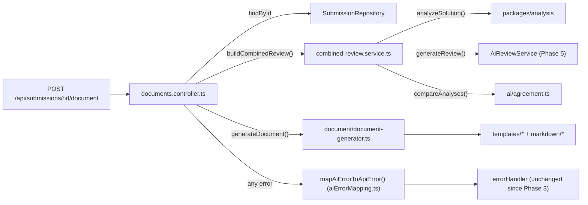

# Phase 6 — Document Generation

## Objective

Convert the complete problem + user's submitted solution + Phase 4's deterministic analysis +
Phase 5's AI review into a professional, Markdown-formatted DSA learning document — without
implementing document persistence or GitHub publishing (both explicitly deferred to Phase 7).

## Implementation Summary

A new `apps/api/src/document/` module (`markdown/`, `templates/`, `formatter/`,
`document-generator.ts`) turns a `CombinedSolutionReview` (Phase 5) plus the stored submission's
`problem`/`submission` data into one complete Markdown document, matching the task's exact
18-section structure. A new `POST /api/submissions/:id/document` endpoint exposes it, sharing
its AI-review-generation pipeline with the existing review endpoint via a newly extracted
`services/combined-review.service.ts`. Two fields (`pseudocode`, `code`) were added to Phase 5's
`betterApproach` AI schema, since the document's "Better Approach" section needs runnable code,
not just a prose description. See [docs/document-generation.md](../document-generation.md) for
the full schema, escaping rules, and filename strategy.

## Architecture

```
apps/api/src/
├── document/                              NEW — Phase 6
│   ├── markdown/
│   │   ├── markdown.ts                     heading/bulletList/blockquote/codeBlock/escapeMarkdown
│   │   ├── markdown.test.ts
│   │   ├── languageTag.ts                  LeetCode language -> fence-language-tag map
│   │   └── languageTag.test.ts (covered indirectly — see document-generator.test.ts)
│   ├── templates/
│   │   ├── shared.ts                       fieldOr() helper
│   │   ├── problemSection.ts
│   │   ├── solutionSection.ts
│   │   ├── complexitySection.ts
│   │   ├── reviewSection.ts
│   │   └── learningSection.ts
│   ├── formatter/
│   │   ├── filename.ts                     generateDocumentFilename()
│   │   └── filename.test.ts
│   ├── types.ts                            DocumentGenerationInput, GeneratedDocument
│   ├── document-generator.ts               generateDocument() — the one exported entry point
│   └── document-generator.test.ts
├── services/
│   ├── combined-review.service.ts          NEW — extracted from reviews.controller.ts
│   └── combined-review.service.test.ts     NEW
├── controllers/
│   ├── aiErrorMapping.ts                    NEW — extracted error-mapping shared by both controllers
│   ├── reviews.controller.ts                MODIFIED — now calls buildCombinedReview()
│   └── documents.controller.ts              NEW
├── routes/
│   ├── documents.route.ts                   NEW
│   ├── documents.route.test.ts              NEW
│   └── index.ts                             MODIFIED — wires the documents controller/router
└── ai/
    ├── schemas/solutionReview.schema.ts      MODIFIED — betterApproach gained pseudocode/code
    ├── schemas/solutionReview.schema.test.ts MODIFIED
    └── prompts/reviewPrompt.ts               MODIFIED — asks the AI for pseudocode/code
```

### Request flow



`reviews.controller.ts`'s flow is identical up through `buildCombinedReview()` — the two
endpoints diverge only in what they do with the resulting `CombinedSolutionReview`: return it as
JSON (`/review`) or turn it into Markdown (`/document`).

## Every Important File

### `apps/api/src/document/markdown/markdown.ts`

**Why:** the task requires "do not generate Markdown inside controllers" and implies a dedicated
module structure (`markdown/`, `templates/`, `formatter/`) — this is the one place that actually
knows Markdown syntax (heading levels, fence characters, escape sequences). Every template
function is built exclusively from these primitives.
**What:** `heading()`, `bulletList()`, `blockquote()`, `codeBlock()` (dynamic fence-width
selection so code containing its own ` ``` ` can't break out), `escapeMarkdown()` (inline
character escaping + leading block-marker neutralization, line by line).
**Where used:** every file in `templates/`, and `document-generator.ts` directly for the H1 title
and footer.
**Future dependencies:** none currently; a future rich document format (HTML export, PDF) would
likely need a parallel primitives file rather than reusing this one, since HTML/PDF escaping
rules differ entirely.

### `apps/api/src/document/markdown/languageTag.ts`

**Why:** the "My Solution" and "Better Approach" code blocks should get syntax highlighting on
GitHub; GitHub's highlighter expects lowercase language identifiers (`javascript`, `cpp`) that
don't always match LeetCode's own display names (`C++`, `Python3`).
**What:** `fenceLanguageTag(language)` — a lookup table from `LeetCodeLanguage` to a fence tag,
falling back to no tag (plain fence) for anything unmapped rather than guessing.
**Where used:** `templates/solutionSection.ts`, `templates/reviewSection.ts`.
**Future dependencies:** none.

### `apps/api/src/document/formatter/filename.ts`

**Why:** the task requires "generate safe filenames" and to "choose one consistent format" —
this is the one place filenames are decided.
**What:** `generateDocumentFilename({ slug, number, title })` → `"NNN-slug.md"` or `"slug.md"`.
Re-sanitizes its input defensively (lowercases, collapses non-alphanumeric runs including `/`,
`\`, `..` into hyphens) rather than trusting the caller, even though Phase 3's schema already
guarantees a clean `problem.slug`.
**Where used:** `document-generator.ts`.
**Future dependencies:** Phase 7 (GitHub publishing) will very likely reuse this exact function
to decide the committed file's path in the target repository — this is why it was written to be
safe standalone rather than assuming Phase 3's validation is the only thing protecting it.

### `apps/api/src/document/templates/shared.ts`

**Why:** several sections need "render this nullable field, or a fallback label" — a small
enough pattern that a dedicated file, not a class, is the right amount of structure.
**What:** `fieldOr(value, fallback)` — escapes a non-null value, or returns the fallback text
unescaped (fallback strings are our own static text, not untrusted data).
**Where used:** `problemSection.ts`, `complexitySection.ts`.

### `apps/api/src/document/templates/problemSection.ts`

**Why/what:** renders `## Problem Information` (a bullet list of number/title/difficulty/URL/
language/status/runtime/memory) and `## Problem Understanding` (the AI's `problemSummary`, plus
the raw extracted description in a blockquote for reference, when present).
**Where used:** `document-generator.ts`.
**Depends on:** `markdown/markdown.ts`, `templates/shared.ts`, `@codereviewai/shared`'s
`LeetCodeProblemInfo`/`LeetCodeSubmissionInfo`.

### `apps/api/src/document/templates/solutionSection.ts`

**Why/what:** renders `## My Solution` (the submitted code, unescaped, labeled **YOUR
SOLUTION**), `## My Approach` (AI's `userApproach`), `## DSA Pattern Used` (AI patterns +
static-analysis patterns + an explicit agreement/disagreement note), and `## Why My Solution
Works` (AI's `whyItWorks`). The one file that receives raw `submission.code` and is
responsible for never letting it pass through `escapeMarkdown()`.
**Where used:** `document-generator.ts`.
**Depends on:** `markdown/markdown.ts`, `markdown/languageTag.ts`, `ai/agreement.ts`'s
`ReviewAgreement`, `ai/schemas/solutionReview.schema.ts`'s `SolutionReview`.

### `apps/api/src/document/templates/complexitySection.ts`

**Why/what:** renders `## Complexity Analysis` — a headline verdict, LeetCode's own reported
runtime/memory, the static estimate (with confidence), the AI assessment, and an explicit
agreement note (reusing `ReviewAgreement`) — the task's "separate: user's solution complexity /
LeetCode runtime&memory / static estimate / AI assessment" requirement.
**Where used:** `document-generator.ts`.
**Depends on:** `markdown/markdown.ts`, `templates/shared.ts`, `@codereviewai/analysis`'s
`SolutionAnalysis`, `ai/agreement.ts`, `ai/schemas/solutionReview.schema.ts`.

### `apps/api/src/document/templates/reviewSection.ts`

**Why/what:** renders `## What I Did Well`, `## What Can Be Improved` (AI's `improvements` plus
`correctnessConcerns` when present), `## Is My Solution Optimal?` (Yes/No + reasoning), `##
Better Approach` (an explicit "no better approach exists" statement when
`betterApproach === null`, otherwise a **RECOMMENDED SOLUTION** with description, pseudocode,
code, complexity, and why it's better), and `## Alternative Approaches`. This is the other half
(besides `solutionSection.ts`) of the task's "distinguish YOUR SOLUTION from RECOMMENDED
SOLUTION" requirement.
**Where used:** `document-generator.ts`.
**Depends on:** `markdown/markdown.ts`, `markdown/languageTag.ts`, `ai/schemas/solutionReview.schema.ts`.

### `apps/api/src/document/templates/learningSection.ts`

**Why/what:** renders `## Edge Cases` (AI edge cases + static-analysis edge-case observations),
`## Interview Explanation` (a templated blockquote composed from `userApproach`/`whyItWorks`/
`complexity` — not a new AI field, see [document-generation.md](../document-generation.md)),
`## Key Learning` (AI's `learningPoints`), `## Related Problems / Patterns` (AI's
`relatedPatterns`), and `## Personal Review` (a templated closing summary: optimality verdict,
top learning point, both confidence levels, and a disagreement callout if applicable).
**Where used:** `document-generator.ts`.
**Depends on:** `markdown/markdown.ts`, `@codereviewai/analysis`'s `SolutionAnalysis`,
`ai/agreement.ts`, `ai/schemas/solutionReview.schema.ts`.

### `apps/api/src/document/types.ts`

**Why:** `document-generator.ts` needs an input shape `CombinedSolutionReview` alone doesn't
provide (`problem`/`submission`), and an output shape for its result.
**What:** `DocumentGenerationInput { problem, submission, review }`,
`GeneratedDocument { filename, content }`.
**Where used:** `document-generator.ts`, `documents.controller.ts`.

### `apps/api/src/document/document-generator.ts`

**Why:** the single orchestrator — the only function outside `document/` ever needs to call.
**What:** `generateDocument(input)` — guards against a null `submission.code` (mirrors the same
invariant guard in `combined-review.service.ts`, defense in depth since this module is meant to
be safe standalone), assembles the H1 title, all six section groups in the task's specified
order, and a footer (generation timestamp + submission id), then computes the filename via
`formatter/filename.ts`.
**Where used:** `controllers/documents.controller.ts` — the only caller anywhere in the codebase.
**Future dependencies:** Phase 7 (GitHub publishing) will call this (indirectly, via the
`/document` endpoint or by importing it directly) to get the content it commits.

### `apps/api/src/services/combined-review.service.ts`

**Why:** Phase 5's `reviews.controller.ts` originally inlined "run `analyzeSolution()`, call
`AiReviewService`, call `compareAnalyses()`" directly. Phase 6's document endpoint needs the
exact same `CombinedSolutionReview` before it can generate a document — duplicating that logic
into a second controller would let the two endpoints drift apart. Extracted here so both share
one implementation.
**What:** `buildCombinedReview(submission, reviewService)` — the guard-then-analyze-then-review-
then-compare pipeline; `MissingCodeError` — thrown (and left HTTP-agnostic, matching how
`ai/errors.ts`'s `AiReviewError` is also HTTP-agnostic) when a stored submission's code is
somehow null, an invariant Phase 3's schema should make impossible.
**Where used:** `controllers/reviews.controller.ts` (Phase 5, now refactored to call this
instead of inlining the logic), `controllers/documents.controller.ts` (Phase 6).
**Future dependencies:** Phase 7 will very likely call this too, if/when GitHub publishing needs
a fresh `CombinedSolutionReview` at commit time rather than reusing one already computed for a
`/document` response.

### `apps/api/src/controllers/aiErrorMapping.ts`

**Why:** both `reviews.controller.ts` and `documents.controller.ts` need to translate the same
two failure types (`AiReviewError`, `MissingCodeError`) into the same HTTP status/error codes —
extracted so that mapping is defined once.
**What:** `mapAiErrorToApiError(error)` — the exact mapping introduced in Phase 5
(`TIMEOUT`→504, `RATE_LIMITED`→429, `MALFORMED_RESPONSE`/`SCHEMA_VALIDATION_FAILED`/
`PROVIDER_ERROR`→502), plus `MissingCodeError`→500 `INTERNAL_ERROR`.
**Where used:** `controllers/reviews.controller.ts`, `controllers/documents.controller.ts`.

### `apps/api/src/controllers/documents.controller.ts`

**Why:** the HTTP-facing entry point for document generation — deliberately thin, per the task's
"do not generate Markdown inside controllers": it never imports anything from `markdown/` or
`templates/`, only `document-generator.ts`'s single exported function.
**What:** `createDocumentsController({ submissionService, reviewService })` → looks up the
submission (404 via `NotFoundError` if missing), calls `buildCombinedReview()`, calls
`generateDocument()`, responds `200` with `{ filename, content }`; any thrown error goes through
`mapAiErrorToApiError()`.
**Where used:** `routes/documents.route.ts`, wired in `routes/index.ts`.

### `apps/api/src/routes/documents.route.ts`

**Why/what:** mounts `POST /submissions/:id/document` — `POST`, not `GET`, matching
`reviews.route.ts`'s precedent: this triggers a real, billed AI call and isn't a pure/cacheable
read.
**Where used:** `routes/index.ts`.

### Modified: `apps/api/src/ai/schemas/solutionReview.schema.ts`

**What changed:** `betterApproachSchema`'s object gained `pseudocode: z.string().trim().min(1)`
and `code: z.string().trim().min(1)` — both required whenever `betterApproach` itself is
non-null. **Why:** the document's "Better Approach" section must "show pseudocode" and "show
improved code" — data no existing field carried. See
[document-generation.md](../document-generation.md#two-extensions-to-the-ai-schema) for the full
rationale and the deliberate choice *not* to add a similar new field for "Interview
Explanation" (composed from existing fields instead).

### Modified: `apps/api/src/ai/prompts/reviewPrompt.ts`

**What changed:** the system prompt's `betterApproach` field description now asks for
`pseudocode` and `code` alongside `description`/`complexity`/`whyBetter`. No other prompt
content changed.

### Modified: `apps/api/src/controllers/reviews.controller.ts`

**What changed:** refactored to call `buildCombinedReview()` and `mapAiErrorToApiError()`
instead of inlining that logic — behavior is unchanged (verified by the existing, unmodified
`routes/reviews.route.test.ts` suite still passing against the refactored controller).

### Modified: `apps/api/src/routes/index.ts`

**What changed:** constructs `documentsController` (reusing the same `submissionService`/
`reviewService` instances already built for the reviews controller) and mounts
`createDocumentsRouter(documentsController)`.

## Example generated document

Generated live via `POST /api/submissions/:id/document` against the real Gemini provider
(`AI_PROVIDER=gemini`), from this submission:

```json
{
  "problem": {
    "url": "https://leetcode.com/problems/two-sum/",
    "slug": "two-sum",
    "number": 1,
    "title": "Two Sum",
    "difficulty": "Easy",
    "description": "Given an array of integers nums and an integer target, return indices of the two numbers such that they add up to target. You may assume that each input would have exactly one solution, and you may not use the same element twice."
  },
  "submission": {
    "language": "JavaScript",
    "code": "var twoSum = function(nums, target) {\n  for (let i = 0; i < nums.length; i++) {\n    for (let j = i + 1; j < nums.length; j++) {\n      if (nums[i] + nums[j] === target) return [i, j];\n    }\n  }\n  return [];\n};",
    "status": "Accepted",
    "runtime": "120 ms",
    "memory": "44 MB"
  }
}
```

Response `filename`: `001-two-sum.md`. Full response `content`:

````markdown
# LeetCode Problem: Two Sum

## Problem Information
- **Problem Number:** 1
- **Title:** Two Sum
- **Difficulty:** Easy
- **URL:** <https://leetcode.com/problems/two-sum/>
- **Language:** JavaScript
- **Submission Status:** Accepted
- **Runtime:** 120 ms
- **Memory:** 44 MB

## Problem Understanding
Find two indices in an array of integers \`nums\` whose values sum up to a given \`target\` integer.

**Original problem statement (as extracted):**

> Given an array of integers nums and an integer target, return indices of the two numbers such that they add up to target. You may assume that each input would have exactly one solution, and you may not use the same element twice.

## My Solution

**YOUR SOLUTION** (submitted code — shown exactly as submitted, unmodified):

```javascript
var twoSum = function(nums, target) {
  for (let i = 0; i < nums.length; i++) {
    for (let j = i + 1; j < nums.length; j++) {
      if (nums[i] + nums[j] === target) return [i, j];
    }
  }
  return [];
};
```

## My Approach

Uses a brute-force approach with two nested loops to check every possible pair of numbers until a pair summing to target is found.

## DSA Pattern Used

**AI-identified patterns:**
- Brute Force
- Nested Loops

**Static-analysis-detected patterns:**
- None detected.

⚠️ Only the AI identified: Brute Force, Nested Loops.

## Why My Solution Works

By iterating through all unique pairs (i, j) where i \< j, it guarantees finding the matching pair if one exists.

## Complexity Analysis

**Your Solution's Complexity:** Time O(n^2), Space O(1) (static analysis and the AI agree).

**LeetCode Reported Runtime/Memory:** Runtime: 120 ms, Memory: 44 MB

**Static Analysis Estimate:** Time O(n^2) (confidence: medium), Space O(1) (confidence: medium)

**AI Assessment:** Time O(n^2), Space O(1)

**Agreement:** ✅ Static analysis and the AI review agree on both time and space complexity.

## What I Did Well

- Simple, straightforward, and easy to read.
- Uses minimal memory with O(1) extra space.

## What Can Be Improved

- Optimize time complexity from O(n^2) to O(n) using a hash map to store numbers and their indices as you iterate.

## Is My Solution Optimal?

**No.** Checking all pairs takes quadratic time O(n^2). This problem can be solved in linear time O(n) using a hash map.

## Better Approach

**RECOMMENDED SOLUTION** (a different approach than what you submitted — not a modification of your code):

Store each element's index in a Hash Map (\`Map\` in JavaScript) as you iterate through the array. For each element \`nums[i]\`, check if its complement (\`target - nums[i]\`) is already in the map. If it is, return the complement's index and current index \`i\`.

**Pseudocode:**

```
Initialize an empty Map
Loop through nums with index i:
  complement = target - nums[i]
  If Map has complement:
    Return [map.get(complement), i]
  Store nums[i] -> i in Map
Return []
```

**Improved Code:**

```javascript
var twoSum = function(nums, target) {
  const map = new Map();
  for (let i = 0; i < nums.length; i++) {
    const complement = target - nums[i];
    if (map.has(complement)) {
      return [map.get(complement), i];
    }
    map.set(nums[i], i);
  }
  return [];
};
```

**Complexity:** Time O(n), Space O(n)

**Why This Is Better:** Reduces the time complexity from O(n^2) to O(n) because map insertions and lookups take O(1) average time.

## Alternative Approaches

- Sort the array while preserving original indices, then use two pointers moving inward from both ends (O(n log n) time, O(n) space).

## Edge Cases

**AI-identified edge cases:**

- None identified.

**Static-analysis edge-case observations:**

- [info] Empty input: The code loops over its input but no explicit empty-input check (e.g. a length/size guard) was found. Many loops naturally handle an empty input fine — this is a prompt to double-check, not a confirmed bug.

## Interview Explanation

A concise explanation you could give out loud in an interview:

> **Approach:** Uses a brute-force approach with two nested loops to check every possible pair of numbers until a pair summing to target is found.
>
> **Why it works:** By iterating through all unique pairs (i, j) where i \< j, it guarantees finding the matching pair if one exists.
>
> **Complexity:** O(n^2) time, O(1) space.

## Key Learning

- Trading auxiliary space (using a hash table) for significantly faster execution time is a fundamental DSA strategy.

## Related Problems / Patterns

- Hash Map
- Two Pointers

## Personal Review

- **Solution status:** Can be improved ⚠️
- **Most important takeaway:** Trading auxiliary space (using a hash table) for significantly faster execution time is a fundamental DSA strategy.
- **AI review confidence:** high
- **Static analysis confidence:** medium
- **Note:** the static analysis and AI review disagreed on at least one point above (complexity and/or pattern detection) — worth double-checking yourself rather than trusting either blindly.

---
_Generated by CodeReviewAI on 2026-09-16T18:56:08.564Z. Submission ID: \`aec5a529-ee9a-4363-b9e5-180053c05ad6\`._
````

This example demonstrates the disagreement-surfacing requirement working correctly in practice:
the deterministic engine (which only recognizes 19 specifically named patterns — see
[docs/phases/phase-04.md](phase-04.md)) didn't tag "Brute Force" for this exact code, while the
AI did. The document shows both views and explicitly flags the mismatch rather than picking one
silently.

## Testing

68 new tests across 6 new/modified test files, all offline (no network calls — every AI-facing
test still uses `ai/providers/mockProvider.ts`, unchanged from Phase 5):

- **`document/markdown/markdown.test.ts`** (22 tests) — heading levels; bullet-list rendering
  and its empty fallback; blockquote line-prefixing; code-fence width selection (plain code,
  code containing a 3-backtick run, code containing a 5-backtick run, code with no backticks at
  all) and exact preservation of the code's own content; `escapeMarkdown()`'s inline-character
  escaping, leading-marker neutralization (heading, bullet, blockquote, ordered list, setext
  underline), that it leaves ordinary punctuation alone, and that it can't be used to break out
  of a fenced code block.
- **`document/formatter/filename.test.ts`** (10 tests) — zero-padded numbering, no truncation
  for numbers ≥ 1000, omitted prefix when number is null, messy-slug sanitization,
  path-traversal-shaped input (`../../etc/passwd`, `..\windows\system32`) collapsing safely,
  title fallback, and the fully-empty fallback.
- **`document/document-generator.test.ts`** (35 tests) — grouped exactly along the task's
  testing checklist: required sections (all 18 headings present, in the specified order); title
  (from problem title, falling back to slug); exact code preservation (byte-for-byte, labeled
  YOUR SOLUTION, never confused with a populated RECOMMENDED SOLUTION, and safe with embedded
  triple-backtick sequences); complexity (static + AI + LeetCode runtime/memory, and the
  disagreement-surfacing path); AI analysis content (approach, why-it-works, strengths,
  learning points, the Yes/No optimality answer); missing optional fields (null
  betterApproach, null difficulty/description/runtime/memory, empty arrays, no description
  block when null); special Markdown characters (heading-shaped and bullet-shaped lines inside
  AI prose, markdown-significant characters in the title, raw `<script>`-shaped text, special
  characters preserved unescaped inside code blocks, a problem description containing multiple
  structural line types at once); filename; footer; and the impossible-null-code guard.
- **`routes/documents.route.test.ts`** (5 tests) — full HTTP integration via Supertest: a 200
  with real content assertions, 404 for an unknown id, AI-provider-timeout mapping to 504, AI
  schema-validation failure mapping to 502, and the disagreement text appearing inside the
  actual HTTP response body for nested-loop code.
- **`services/combined-review.service.test.ts`** (3 tests, new) — the extracted shared helper:
  a successful combine, `MissingCodeError` for a null-code submission, and that a provider
  failure propagates unchanged.
- **`ai/schemas/solutionReview.schema.test.ts`** (updated, +3 tests) — a populated
  `betterApproach` now requires `pseudocode`/`code` alongside the existing fields; two new
  tests reject a `betterApproach` missing either one specifically.

Every pre-existing Phase 1-5 test file was re-run unmodified and still passes, including
`routes/reviews.route.test.ts` (confirms the `reviews.controller.ts` refactor didn't change
behavior) and the full `ai/` suite (confirms the schema/prompt extension didn't break any
existing fixture, since every existing fixture leaves `betterApproach: null`).

## Commands

```bash
npm run test -w @codereviewai/api      # 186 tests, api workspace
npm run test                            # 318 tests, full repo
npm run typecheck
npm run lint
npm run format:check
npm run build
```

## Verification

1. Ran the full document-module test suite in isolation, then the whole `apps/api` suite, then
   the whole repo — all green (318 tests across 5 workspaces).
2. `npx tsc -p apps/api/tsconfig.json --noEmit` after each major change (the schema extension,
   the controller refactor, the new module) to catch type errors incrementally rather than at
   the end.
3. Confirmed `npm run build` output excludes every `*.test.ts` file from `apps/api/dist/document/`
   (`find apps/api/dist/document -type f` shows only the 11 production `.js` files, no tests).
4. **Live smoke test against the real Gemini API** (`AI_PROVIDER=gemini`, a real key): started
   the dev server, created a real submission via `POST /api/submissions`, called
   `POST /api/submissions/:id/document`, and got back a complete, well-formed, 5.1KB Markdown
   document — the exact example shown above. This is a real, non-mocked confirmation that the
   whole pipeline (schema-extended AI prompt → live Gemini response → schema validation →
   document generation → escaping) works end-to-end, not just against test fixtures.
5. `npm run lint` / `npm run format:check` — clean after one `prettier --write` pass over the
   newly created files.
6. Server processes started for the live smoke test were shut down and port 4000 confirmed free
   afterward (same verification discipline as Phase 5).

## Limitations

See [docs/document-generation.md#limitations](../document-generation.md#limitations) for the
full list. Specific to this phase's scope:

- No document persistence and no GitHub publishing, as explicitly required — the endpoint
  returns Markdown; nothing is saved or committed anywhere.
- "Is My Solution Optimal?" only answers Yes/No (Phase 5's `optimality.isOptimal` is a plain
  boolean) — the task's structure mentions a "Depends" outcome, but widening that schema again
  wasn't judged necessary for this phase.
- Escaping targets GitHub-Flavored Markdown specifically, not the strictest CommonMark reading.
- No execution-based verification of the "Better Approach" code — it's AI-generated and
  unverified, same as every other AI claim in this system.

## What Phase 7 Will Implement

Per the roadmap in the README, Phase 7 adds GitHub publishing: authenticating to GitHub
(`GITHUB_TOKEN`/`GITHUB_REPO`, already documented as unused placeholders in `.env.example` since
Phase 1) and using the GitHub REST API to create or update the Markdown file this phase already
knows how to generate, in a user-specified repository — most likely reusing
`document/document-generator.ts` and `document/formatter/filename.ts` completely unchanged,
since neither has any knowledge of *where* the document ends up.
