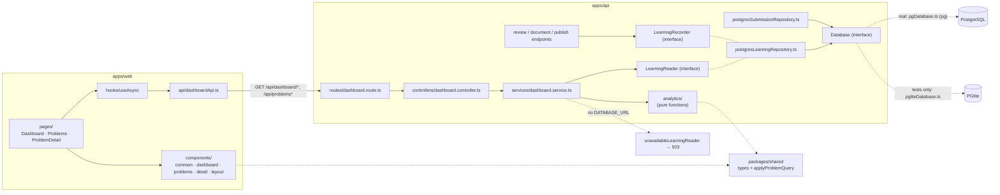

# Phase 8 — Dashboard & Learning Analytics

## Objective

Build a web dashboard showing the user's DSA learning progress — headline stats, per-pattern
analytics, a searchable/filterable/sortable problem list, and a per-problem detail view — backed
by a real PostgreSQL persistence layer with migrations.

## Implementation Summary

- **Persistence** (`apps/api/src/persistence/`): PostgreSQL behind a small `Database` interface,
  a versioned migration runner, and six tables — `users`, `problems`, `submissions`, `analyses`,
  `reviews`, `documents`. Optional: with no `DATABASE_URL` the API behaves exactly as it did in
  Phase 7. See [docs/database.md](../database.md).
- **Analytics** (`apps/api/src/analytics/`): pure, database-free functions for the quality score,
  streaks, pattern normalization, and every dashboard statistic.
- **API**: four read endpoints — `GET /api/dashboard/summary`, `GET /api/dashboard/patterns`,
  `GET /api/problems`, `GET /api/problems/:id`. See [docs/api.md](../api.md#dashboard-endpoints).
- **Recording**: `POST …/review`, `…/document`, and `…/publish` now also record their results
  (best-effort) so the dashboard has data.
- **UI** (`apps/web`): a three-page dashboard built from ~20 small, reusable components — no
  giant `Dashboard.tsx`.
- **Shared** (`packages/shared`): the dashboard's wire types plus the one implementation of
  problem search/filter/sort.

## Architecture



Two data flows:

1. **Write path** — `POST /api/submissions` writes a `problems` row (upserted by slug) and a
   `submissions` row. `POST …/review` recomputes the static analysis + AI review as before, then
   *also* upserts `analyses` and `reviews` (computing the quality score). `POST …/document` upserts
   `documents`. `POST …/publish` additionally stores the GitHub link on that `documents` row.
2. **Read path** — the dashboard endpoints load one record per problem (latest submission,
   left-joined to analysis/review/document), and pure functions turn those records into
   summary/pattern/list/detail responses.

## Every Important File

### Persistence — `apps/api/src/persistence/`

| File | Purpose / why | Used by | Depends on |
| --- | --- | --- | --- |
| `database.ts` | The `Database` interface (`query`, `exec`, `transaction`, `close`) — the only thing repositories depend on, so `pg` can be swapped or faked. Mirrors `AiProvider`/`GitHubClient`. | every repository, `migrate.ts` | — |
| `pgDatabase.ts` | The real `Database` over `pg`'s connection pool — the **only** file that imports `pg`. Transactions use a dedicated client with `BEGIN/COMMIT/ROLLBACK`. | `createDatabaseFromEnv.ts` | `pg` |
| `pgliteDatabase.ts` | Test-only `Database` over PGlite (real Postgres, in-process) so tests run genuine SQL with no server. Excluded from the production build. | persistence and dashboard tests | `@electric-sql/pglite` (dev) |
| `createDatabaseFromEnv.ts` | Reads `DATABASE_URL`/`DATABASE_SSL`; returns `null` when unset so the API still starts. | `index.ts`, `migrateCli.ts` | `pgDatabase.ts` |
| `migrate.ts` | `runMigrations(db)` — applies pending migrations in id order, each in its own transaction, recorded in `schema_migrations`; idempotent. | `index.ts`, `migrateCli.ts`, tests | `database.ts`, `migrations/` |
| `migrations/001_initial_schema.ts` | The schema: six tables, indexes, constraints, and the seeded local user. Also exports `DEFAULT_USER_ID`. | `migrate.ts`, both Postgres repositories | — |
| `migrations/index.ts`, `migrations/types.ts` | The ordered migration list and the `Migration` shape. **Future:** every schema change adds a module here. | `migrate.ts` | — |
| `migrateCli.ts` | `npm run db:migrate` — apply migrations and exit. | operators | `migrate.ts` |
| `postgresSubmissionRepository.ts` | `SubmissionRepository` over `problems` + `submissions` — the Postgres twin of `InMemorySubmissionRepository`, so `SubmissionService` is unchanged. Returns `null` for a non-UUID id rather than erroring. | `routes/index.ts` | `database.ts` |
| `learningRepository.ts` | The `LearningRecorder` (writes) and `LearningReader` (reads) interfaces, split so writers never depend on queries. | controllers, `DashboardService` | — |
| `postgresLearningRepository.ts` | Implements both: upserts `analyses`/`reviews`/`documents`, and runs the dashboard queries (latest-submission-per-problem via `DISTINCT ON`, problem detail). Stores full `jsonb` plus extracted columns. | `routes/index.ts` | `database.ts`, `analytics/qualityScore.ts` |
| `unavailableLearningReader.ts` | The reader used with no database — every method rejects `503 DATABASE_NOT_CONFIGURED`. | `routes/index.ts` | `types/errors.ts` |
| `bestEffort.ts` | Runs a recording action and logs (message only) instead of throwing on failure. | `combined-review.service.ts`, controllers | — |
| `rowMapping.ts` | `Date`/`jsonb` → wire-format helpers. | both Postgres repositories | — |

### Analytics — `apps/api/src/analytics/`

| File | Purpose / why | Used by |
| --- | --- | --- |
| `patterns.ts` | Maps free-text pattern names onto the 16 tracked patterns with an ordered rule list; never guesses an untracked pattern (`Brute Force`) into a tracked one. | `statistics.ts` |
| `qualityScore.ts` | `computeQualityScore` (100 minus capped penalties) and `needsImprovement`. Weights documented in [docs/database.md](../database.md#quality-score). | `postgresLearningRepository.ts`, `statistics.ts` |
| `streak.ts` | Current/longest streak over UTC days; the clock is injected. | `statistics.ts` |
| `statistics.ts` | `ProblemRecord`, `buildSummary`, `buildPatternStats`, `toProblemListItem` — every dashboard number. | `dashboard.service.ts` |

### API layer

| File | Purpose / why | Used by |
| --- | --- | --- |
| `services/dashboard.service.ts` | Fetches records from a `LearningReader` and delegates to the pure analytics + shared query functions. `now` injectable. | `dashboard.controller.ts` |
| `controllers/dashboard.controller.ts` | Thin handlers: validate the query, call the service, wrap in the `ApiResponse` envelope. | `dashboard.route.ts` |
| `routes/dashboard.route.ts` | Mounts the four `GET` routes. | `routes/index.ts` |
| `schemas/problemQuery.schema.ts` | Zod validation for `GET /api/problems` query strings; empty values count as absent. | `dashboard.controller.ts` |
| `routes/index.ts` *(modified)* | Composition root: with `deps.database` it builds the Postgres repositories and recorder; without, the in-memory repository and the 503 reader. | `app.ts` |
| `app.ts` *(modified)* | `AppConfig` gained `database` and `now` (test-only) options. | `index.ts`, tests |
| `index.ts` *(modified)* | Now an async bootstrap: build the database from env, run migrations, then listen. | `npm run dev/start` |
| `services/combined-review.service.ts` *(modified)* | Optional `recorder` argument: after building the review, record it (best-effort). | review/document/publish controllers |
| `controllers/{reviews,documents,publish}.controller.ts` *(modified)* | Pass the recorder through; `documents`/`publish` also record the document and GitHub link. | routes |
| `services/github-publish.service.ts`, `github/*` *(modified)* | `GitHubRepositoryInfo` gained `htmlUrl`; `PublishResult` gained `documentUrl` (`<repo>/blob/<branch>/<path>`) — how the dashboard links to the published file. | publish controller, dashboard |

### Shared — `packages/shared/src/`

| File | Purpose / why | Used by |
| --- | --- | --- |
| `types/dashboard.ts` | The dashboard wire contract (`DashboardSummary`, `PatternStat`, `ProblemListItem`, `ProblemDetail`, `ProblemListQuery`, …) and `TRACKED_PATTERNS`. Hand-written DTOs, so the web app never imports server code. | API and web |
| `dashboard/problemQuery.ts` | `filterProblems` / `sortProblems` / `applyProblemQuery` — the one definition of search, filter, and sort (nulls last, complexity by growth rate). | `dashboard.service.ts` |

### Web — `apps/web/src/`

| Path | Purpose / why | Used by |
| --- | --- | --- |
| `api/dashboardApi.ts` | Typed fetch client; turns API error envelopes and network failures into `ApiRequestError`; builds query strings that skip empty values. | pages |
| `hooks/useAsync.ts` | Loading/success/error for a request; ignores stale responses; keeps previous data while refetching; derives "loading" rather than setting it in an effect. | pages |
| `router/routes.ts` | `parseRoute`, `problemPath`, `useHashRoute` — three-page hash routing with no router dependency. | `App.tsx`, links |
| `format.ts` | Stable UTC date formatting. | components |
| `pages/DashboardPage.tsx` | Composes independent, separately-loading panels (each fails on its own). | `App.tsx` |
| `pages/ProblemsPage.tsx` | Owns the query (filters + sort); every change refetches from the API. | `App.tsx` |
| `pages/ProblemDetailPage.tsx` | Composes the detail panels. | `App.tsx` |
| `components/common/` | `Badge` (+ `tones.ts`), `StatCard`, `Section`, `CodeBlock` (renders code as React text — never as markup), `LoadState` (`Loadable`, loading/error/empty). | everywhere |
| `components/dashboard/` | `StatGrid`, `DifficultyDistribution` (CSS bars, no chart library), `PatternAnalytics`, `RecentProblems`. | `DashboardPage` |
| `components/problems/` | `ProblemFilters` (controlled search + dropdowns), `ProblemTable` (sortable headers with `aria-sort`). | `ProblemsPage` |
| `components/detail/` | `ProblemInfo`, `SubmissionPanel`, `StaticAnalysisPanel`, `AiReviewPanel` (shows a disagreement notice), `BetterApproachPanel` (labeled RECOMMENDED), `LearningPanel`, `GithubPanel`. | `ProblemDetailPage` |
| `components/layout/` | `AppHeader` (nav), `BackendStatus` (the Phase 1 health check, kept as a header widget). | `App.tsx` |
| `App.tsx` *(rewritten)* | Header + route switch. | `main.tsx` |
| `index.css` *(rewritten)* | Light/dark theme via CSS variables; no CSS framework. | — |
| `testing/fixtures.ts` | Test builders and a URL-routed `fetch` mock. Test-only. | web tests |

### Ops files

- **`docker-compose.yml`** — optional local Postgres. The password comes from `POSTGRES_PASSWORD` in
  your environment and the file refuses to start without it (`${POSTGRES_PASSWORD:?…}`).
- **`.env.example`** *(modified)* — documents `DATABASE_URL`, `DATABASE_SSL`, `POSTGRES_PASSWORD`
  (names only).
- **`apps/api/vitest.config.ts`** — raises hook/test timeouts because several test files each boot
  an in-process Postgres and the default 10s is too tight when they start in parallel.
- **`apps/api/package.json`** *(modified)* — `db:migrate`, `db:migrate:built`; new deps `pg`,
  dev deps `@electric-sql/pglite`, `@electric-sql/pglite-socket`, `@types/pg`.
  **`apps/web/package.json`** — dev dep `@testing-library/user-event`.
- **`apps/api/tsconfig.build.json`** *(modified)* — also excludes `src/persistence/pgliteDatabase.ts`
  and `src/testing/` from the build.

## API

Four `GET` endpoints, fully documented (parameters, response shapes, error tables) in
[docs/api.md](../api.md#dashboard-endpoints):

| Endpoint | Returns |
| --- | --- |
| `GET /api/dashboard/summary` | `DashboardSummary` — totals, streaks, difficulty distribution, recent problems |
| `GET /api/dashboard/patterns` | `PatternStat[]` — all 16 tracked patterns |
| `GET /api/problems?search&difficulty&pattern&status&language&sortBy&sortOrder` | `ProblemListItem[]` |
| `GET /api/problems/:id` | `ProblemDetail` (`:id` is a submission id) |

## The dashboard

- **Dashboard page:** stat cards (total, accepted, needs improvement, optimal, current streak,
  patterns practiced), difficulty bars, recent problems, and the 16-row pattern table (solved,
  average quality, improvements needed, links to problems to revisit; untouched patterns dimmed
  rather than hidden).
- **Problems page:** search box plus difficulty/pattern/status/language filters and a "Clear
  filters" button; sortable columns for Problem, Difficulty, Language, Status, Complexity,
  Quality, Date and #; each row links to the detail page and, when published, to the GitHub
  document.
- **Detail page:** problem information, **your** submitted code (exactly as submitted), static
  analysis, the AI review (with an explicit notice when static analysis and the AI disagreed), the
  better approach (labeled **RECOMMENDED**, or an explicit "already optimal"), learning points, and
  the GitHub link.

## Testing

**+250 tests** (651 total, up from 401). Nothing calls a real AI, GitHub, or external database:

| Area | File (tests) | What it proves |
| --- | --- | --- |
| Analytics | `patterns.test.ts` (39), `qualityScore.test.ts` (10), `streak.test.ts` (7), `statistics.test.ts` (17) | Every alias mapping and unmapped pattern; each penalty and its cap; streak continuation/reset/month boundary/duplicate days; the statistics (counts, distribution, practiced patterns, average quality, revisit ordering, empty input). |
| **Database repository** (real Postgres via PGlite) | `migrate.test.ts` (9), `postgresSubmissionRepository.test.ts` (9), `postgresLearningRepository.test.ts` (16), `createDatabaseFromEnv.test.ts` (3) | Migrations apply, are idempotent, roll back on failure, apply in order; tables/indexes/constraints exist; exact code round-trip (newlines, quotes, backticks); shared problem rows; transactional rollback; upsert replaces (one review per submission); foreign keys enforced; latest-submission-per-problem; per-user isolation. |
| **API** | `dashboard.route.test.ts` (20) | Summary, patterns, list (every filter, search, sorts, combined, empty params, validation 400s), detail (full, unreviewed, 404, non-UUID), document/GitHub-link recording, best-effort recording failure, re-review replacing the row, 503 without a database, and that the pre-Phase-8 in-memory flow still works. `problemQuery.schema.test.ts` (9). |
| **Filtering & sorting** | `problemQuery.test.ts` in shared (17), plus `pages.test.tsx` / `problemComponents.test.tsx` | The shared filter/sort functions (incl. nulls last, complexity by growth rate) and the UI driving them through the API. |
| **Statistics (UI)** | `dashboardComponents.test.tsx` (16) | Stat values, hints, bar scaling, no divide-by-zero, pattern rows. |
| **Dashboard components** | `dashboardComponents` (16), `problemComponents` (16), `detailComponents` (19), `pages` (14), `App` (6), `useAsync` (6), `dashboardApi` (10), `routes` (8) | Rendering, sorting (aria-sort), filter events, disagreement notice, RECOMMENDED labeling, exact-code display, loading/error/retry, independent panel failure, stale-response handling, routing. |
| Modified | `github-client`, `repository.service`, `github-publish.service` tests | `htmlUrl` / `documentUrl`. |

## Commands

```bash
npm run test                                   # 651 tests, every workspace
npm run typecheck && npm run lint && npm run format:check && npm run build

# with a database
POSTGRES_PASSWORD=… docker compose up -d       # optional local Postgres
# set DATABASE_URL in apps/api/.env, then:
npm run db:migrate -w @codereviewai/api        # or just start the API — it migrates at startup
npm run dev                                    # API :4000 + web :5173 → open http://localhost:5173
```

## Verification

1. `npm run typecheck`, `test` (651), `lint`, `format:check`, and `build` — all clean.
2. Confirmed `find apps/api/dist` contains no `*.test.js`, mock, PGlite, or `testing/` file, and
   that the `persistence/` and `analytics/` production files are present.
3. **Live smoke test of the real `pg` driver**: started the real Express app with
   `createPgDatabase` connected over TCP to a Postgres wire-protocol server (PGlite's socket
   server), ran the migration through it, created a submission, got a **live Gemini review**
   through `POST …/review`, and read it back through all four dashboard endpoints — summary
   (`totalProblems 1`, `needingImprovement 1`, streak 1), the problem list with a pattern filter
   and search, the detail (with `betterApproach.code` and `hasDisagreement: true`), and the pattern
   table. Then `POST …/document` and confirmed the document row appeared in the detail. The quality
   score matched the formula (100 − 25 not optimal − 4 improvement − 5 disagreement = 66). Along the
   way Gemini returned a transient `503 high demand`, which surfaced correctly as `502
   AI_PROVIDER_ERROR`; a retry succeeded.
4. Server and temp files removed; ports confirmed free.

**Not verified:**
- The web UI was **never rendered in a real browser** — no browser automation was available. It was
  verified by typecheck, a production `vite build`, and 95 component/page tests in jsdom against a
  mocked `fetch`. The CSS layout and dark-mode appearance have not been looked at by a human.
- **A stock PostgreSQL server / `docker compose up`** — no Postgres install or running Docker
  daemon here. The SQL ran on PGlite (real Postgres semantics) in-process and over a socket.
- **`POST …/publish` recording against the real GitHub API** — as in Phase 7, GitHub was mocked.

## Design decisions worth knowing

- **PostgreSQL is optional.** Keeping the no-database path means every prior phase keeps working
  and its tests are unmodified; the cost is one extra branch in the composition root.
- **One row per problem, from its latest submission.** "Total problems" and every pattern number
  count problems, not attempts. Earlier submissions are kept in `submissions` but not surfaced.
- **"Solved" means Accepted.** Pattern `solved` and *Patterns practiced* count Accepted solutions
  only; the problem list shows everything.
- **Untracked patterns don't count.** A brute-force solution adds to *Total problems* but to no
  pattern row — the smoke test's Two Sum showed exactly this (`patternsPracticed: 0`).
- **Aggregation in application code.** Simple, unit-testable without a database, and fast at
  personal scale.
- **Server-side filtering.** The UI refetches on each filter change (one implementation of the
  logic, in `packages/shared`), rather than filtering client-side.

## Limitations

See [docs/database.md#limitations](../database.md#limitations). Specific to this phase:

- UI not seen in a browser; no Postgres server verification (above).
- No pagination on the problem list; no charts beyond CSS bars; no trends over time (one review per
  submission, so no history).
- Streaks use UTC days.
- The quality score's weights are judgment calls.
- Search refetches per keystroke (no debounce).
- Nothing in the extension or web UI *triggers* a review, document, or publish yet — the dashboard
  displays what those endpoints recorded, and they are still called via `curl`/tests.
- A single built-in user; no authentication (not scheduled).

## What Phase 9 Implemented

The earlier roadmap guessed authentication; Phase 9's own kickoff instead scoped **improvement
tracking** — attempt history, comparison, a learning profile, and recommendations, built on the
`submissions` table this phase created. See [phase-09.md](phase-09.md). Authentication and per-user
data (the schema already has `user_id` on every submission and every query is scoped by it) is
not scheduled in any phase yet.
