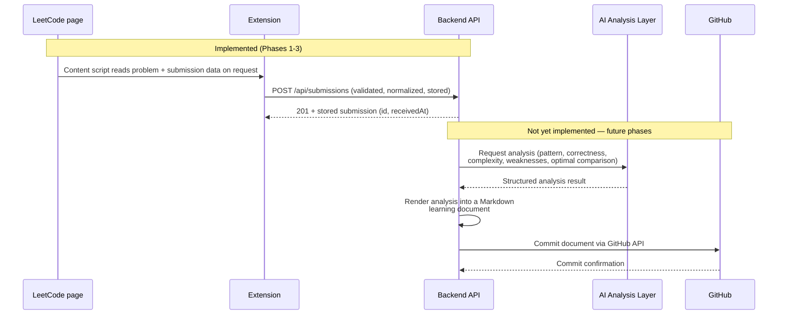

# Project Overview

## Purpose

CodeReviewAI exists to close a gap in how most people practice LeetCode: solving a problem and
moving on without ever writing down *why* the solution worked, what pattern it used, or how it
compares to a better approach. That reflection step is where real learning happens, and it's
also the step almost everyone skips because it's tedious to do by hand after every submission.

CodeReviewAI automates that reflection. It captures a submission at the moment you solve it,
has an AI analyze it the way a thoughtful mentor would, and writes the result down permanently
as a version-controlled document — so a personal library of "what I learned solving X" builds
itself over time, with no manual writing required.

## Intended user workflow

This is the workflow the project is being built toward. **Steps 0–3 exist today** (Phases
1–3); steps 4–8 describe the target end state that later phases implement incrementally.

0. **(Phase 1 — done)** The developer has the project foundation running locally: a frontend,
   a backend, and an extension skeleton that all build, start, and talk to each other.
1. **(Phase 2 — done)** The user opens a LeetCode problem page (`leetcode.com/problems/<slug>`).
   The CodeReviewAI extension's content script can read the problem statement, title,
   difficulty, selected language, submitted code, submission status, runtime, and memory
   directly from the page, on request from the popup — reporting `null` honestly for anything
   it can't find rather than guessing.
2. **(Phase 3 — done)** The user clicks **Submit Solution** in the extension popup. The
   extension sends the captured data to `POST /api/submissions` on the CodeReviewAI backend
   API, which validates every field (never trusting the client), normalizes it, assigns it a
   unique id, and stores it.
3. **(Future)** The backend forwards the problem + code to an AI analysis layer.
4. **(Future)** The AI layer returns a structured analysis: the DSA pattern/technique used, an
   explanation of why the approach is correct, Big-O time/space complexity, weaknesses in the
   current solution, concrete improvement suggestions, and a comparison against a more optimal
   approach where one exists.
5. **(Future)** The backend renders this analysis into a structured Markdown "learning
   document" (problem summary, approach, complexity, critique, optimal comparison).
6. **(Future)** The backend commits that document to a GitHub repository configured by the
   user, via the GitHub API — building an automatically maintained, chronological log of
   solved problems and what was learned from each.
7. **(Future)** The user can browse their full history of analyzed submissions and generated
   documents in the CodeReviewAI web dashboard.

## Main components

| Component            | Role                                                                                   | Status (Phase 3)                                   |
| --------------------- | --------------------------------------------------------------------------------------- | ----------------------------------------------------- |
| `apps/extension`      | Runs in the browser; captures LeetCode submissions and sends them to the API.          | Extracts problem/submission data (Phase 2) and POSTs it to `POST /api/submissions` (Phase 3). |
| `apps/api`             | Central backend; receives submissions today, will run AI analysis and talk to GitHub later. | `GET /api/health` + `POST /api/submissions` (validated, normalized, in-memory storage). |
| `apps/web`             | User-facing dashboard for browsing analyzed submissions.                                | Status page that confirms the API is reachable.      |
| `packages/shared`      | TypeScript contracts shared by all three apps.                                         | `ApiResponse<T>`, health-check types, `LeetCodeExtraction`, the `POST /api/submissions` wire contract, and the LeetCode URL-parsing logic used by both the extension and the API. |
| AI analysis layer      | Will analyze captured code and produce the structured critique described above.        | Not started.                                         |
| GitHub integration layer | Will commit generated documents to a user's repository.                              | Not started.                                         |

## Future workflow: LeetCode → extension → API → AI → document → GitHub

See [architecture.md](architecture.md) for the fully diagrammed current architecture and
[api.md](api.md) for the `POST /api/submissions` reference.
